# The App-Owns-Data Starter Kit

The  **App-Owns-Data Starter Kit** is a developer sample built using the
.NET 6 SDK to provide guidance for organizations and ISVs who are using
App-Owns-Data embedding with Power BI in a multi-tenant environment.
This document describes the high-level design of this solution and
provides step-by-step instructions for setting up the solution for
testing on a local developer workstation.

This developer sample was ***updated in October 2022*** to demonstrate
the best practice of using service principal profiles to create
workspaces and to manage Power BI content. This solution has also been
extended with paginated reports and with a new project named
**AppOwnsDataReactClient** which demonstrates using React-JS and
Material UI to implement App-Owns-Data embedding.

# Table of Contents

[The App-Owns-Data Starter Kit
[1](#the-app-owns-data-starter-kit)](#the-app-owns-data-starter-kit)

[Introduction [2](#introduction)](#introduction)

[Solution Architecture
[3](#solution-architecture)](#solution-architecture)

[Understanding the AppOwnsDataAdmin application
[3](#understanding-the-appownsdataadmin-application)](#understanding-the-appownsdataadmin-application)

[Understanding the AppOwnsDataClient application
[5](#understanding-the-appownsdatawebapi-application)](#understanding-the-appownsdatawebapi-application)

[Understanding the AppOwnsDataReactClient application
[8](#understanding-the-appownsdatareactclient-application)](#understanding-the-appownsdatareactclient-application)

[Understanding the AppOwnsDataWebAPI application
[5](#understanding-the-appownsdatawebapi-application)](#understanding-the-appownsdatawebapi-application)

[Designing a custom telemetry layer
[10](#designing-a-custom-telemetry-layer)](#designing-a-custom-telemetry-layer)

[Understanding the AppOwnsDataShared class library project
[12](#understanding-the-appownsdatashared-class-library-project)](#understanding-the-appownsdatashared-class-library-project)

[Set up your development environment
[13](#set-up-your-development-environment)](#set-up-your-development-environment)

[Create an Azure AD security group named Power BI Apps
[13](#create-an-azure-ad-security-group-named-power-bi-apps)](#create-an-azure-ad-security-group-named-power-bi-apps)

[Configure Power BI tenant-level settings for service principal access
[14](#configure-power-bi-tenant-level-settings-for-service-principal-access)](#configure-power-bi-tenant-level-settings-for-service-principal-access)

[Create the App-Owns-Data Service App in Azure AD
[17](#create-the-app-owns-data-service-app-in-azure-ad)](#create-the-app-owns-data-service-app-in-azure-ad)

[Create the App-Owns-Data Client App in Azure AD
[20](#create-the-app-owns-data-client-app-in-azure-ad)](#create-the-app-owns-data-client-app-in-azure-ad)

[Open the App-Owns-Data Starter Kit solution in Visual Studio 2022
[23](#developing-and-testing-with-a-dedicated-capacity)](#developing-and-testing-with-a-dedicated-capacity)

[Download the source code
[24](#download-the-source-code)](#download-the-source-code)

[Open AppOwnsDataStarterKit.sln in Visual Studio 2022
[25](#open-appownsdatastarterkit.sln-in-visual-studio-2022)](#open-appownsdatastarterkit.sln-in-visual-studio-2022)

[Update the appsettings.json file of AppOwnsDataAdmin project
[25](#update-the-appsettings.json-file-of-appownsdataadmin-project)](#update-the-appsettings.json-file-of-appownsdataadmin-project)

[Create the AppOwnsDataDB database
[27](#create-the-appownsdatadb-database)](#create-the-appownsdatadb-database)

[Test the AppOwnsDataAdmin Application
[29](#test-the-appownsdataadmin-application)](#test-the-appownsdataadmin-application)

[Create new customer tenants
[30](#create-new-customer-tenants)](#create-new-customer-tenants)

[Understanding the PBIX template file named SalesReportTemplate.pbix
[33](#understanding-the-pbix-template-file-named-salesreporttemplate.pbix)](#understanding-the-pbix-template-file-named-salesreporttemplate.pbix)

[Embed reports [36](#embed-reports)](#embed-reports)

[Inspect the Power BI workspaces being created
[36](#inspect-the-power-bi-workspaces-being-created)](#inspect-the-power-bi-workspaces-being-created)

[Configure the application configure the AppOwnsDataWebApi project
[37](#configure-the-application-configure-the-appownsdatawebapi-project)](#configure-the-application-configure-the-appownsdatawebapi-project)

[Update the appsettings.json file for AppOwnsDataWebApi
[37](#update-the-appsettings.json-file-for-appownsdatawebapi)](#update-the-appsettings.json-file-for-appownsdatawebapi)

[Test the AppOwnsDataClient application
[38](#test-the-appownsdataclient-application)](#test-the-appownsdataclient-application)

[Launch AppOwnsDataClient in the Visual Studio debugger
[40](#launch-appownsdataclient-in-the-visual-studio-debugger)](#launch-appownsdataclient-in-the-visual-studio-debugger)

[Assign user permissions
[42](#assign-user-permissions)](#assign-user-permissions)

[Create and edit reports using the AppOwnsDataClient application
[44](#create-and-edit-reports-using-the-appownsdataclient-application)](#create-and-edit-reports-using-the-appownsdataclient-application)

[Test the AppOwnsDataReactClient application
[47](#test-the-appownsdatareactclient-application)](#test-the-appownsdatareactclient-application)

[Launch AppOwnsDataReactClient in the Visual Studio debugger
[49](#launch-appownsdatareactclient-in-the-visual-studio-debugger)](#launch-appownsdatareactclient-in-the-visual-studio-debugger)

[Assign user permissions
[51](#assign-user-permissions-1)](#assign-user-permissions-1)

[Create and edit reports using the AppOwnsDataClient application
[53](#create-and-edit-reports-using-the-appownsdataclient-application-1)](#create-and-edit-reports-using-the-appownsdataclient-application-1)

[Use the Activity Log to monitor usage and report performance
[56](#use-the-activity-log-to-monitor-usage-and-report-performance)](#use-the-activity-log-to-monitor-usage-and-report-performance)

[Inspect usage and performance data using AppOwsDataUsageReporting.pbix
[56](#inspect-usage-and-performance-data-using-appowsdatausagereporting.pbix)](#inspect-usage-and-performance-data-using-appowsdatausagereporting.pbix)

[Next Steps [58](#next-steps)](#next-steps)

## Introduction

The  **App-Owns-Data Starter Kit** is a developer sample built using the
.NET 6 SDK to provide guidance for organizations and ISVs who are using
App-Owns-Data embedding with Power BI in a multi-tenant environment.
This solution consists of a custom database and four separate web
applications which demonstrate best practices and common design patterns
used in App-Owns-Data embedding such as automating the creation of new
Power BI workspaces for customer tenants, assigning user permissions and
monitoring report usage and performance.

If you have worked with Azure AD, the word **"tenant"** might make you
think of an Azure AD tenant. However, the concept of a tenant is
different when designing a multi-tenant environment for App-Owns-Data
embedding. In this context, each tenant represents a customer with one
or more users for which you are embedding Power BI reports. In a
multi-tenant environment, you must create a separate tenant for each
customer. Provisioning a new customer tenant in a Power BI embedding
solution typically involves writing code which programs the Power BI
REST API to create a Power BI workspace, assign the workspace to a
dedicated capacity, import PBIX files, patch datasource credentials and
start dataset refresh operations.

There is a critical aspect to App-Owns-Data embedding that you must
start thinking about during the initial design phase. A distinct
advantage of App-Owns-Data embedding is that you pay Microsoft by
licensing dedicated capacities instead of by licensing individual users.
This allows organizations and ISVs to reach users that remain completely
unknown to Power BI. While keeping users unknown to Power BI has its
advantages, it also introduces a new problem that makes things more
complicated than developing with User-Owns-Data embedding.

So, what's the problem? If Power BI doesn’t know anything about your
users, Power BI cannot really provide any assistance when it comes to
authorization and determining which users should have access to what
content. This isn't a problem in a simplistic scenario where you intend
to give every user the same level of access to the exact same content.
However, it's far more common that your application requirements will
define authorization policies to determine which users have access to
which customer tenants. Furthermore, if you're planning to take
advantage of the Power BI embedding support for report authoring, you'll
also need to implement an authorization scheme that allows an
administrator to assign permissions to users with a granularity of view
permissions, edit permissions and content create permissions.

Now let's make three key observations about developing with
App-Owns-Data embedding. First, you have the **flexibility** to design
the authorization scheme for your application any way you'd like.
Second, you have the ***responsibility*** to design and implement this
authorization scheme from the ground up. Third, it's much easier to
prototype and develop an authorization scheme if your application design
includes a ***custom database*** to track whatever data and metadata you
need to implement the authorization policies and policy enforcement you
require.

The **App-Owns-Data Starter Kit** solution provides a starting point for
organizations and ISVs who are beginning to develop with App-Owns-Data
embedding. This solution was created to provide guidance and to
demonstrate implementing the following application requirements that are
common when developing with App-Owns-Data embedding in a multi-tenant.

- Onboarding new customer tenants

- Assigning and managing user permissions

- Implementing the customer-facing clients as a Single Page Applications
  (SPA)

- Creating a custom telemetry layer to log user activity

- Monitoring user activity for viewing, editing and creating reports

- Monitoring the performance of report loading and rendering

## Solution Architecture

The **App-Owns-Data Starter Kit** solution is built on top of a custom
SQL Server database named **AppOwnsDataDB**. In addition to the
database, the solution contains four Web application projects named
**AppOwnsDataAdmin**, **AppOwnsDataWebApi**, **AppOwnsDataClient** and
**AppOwnsDataReactClient** and as shown in the following diagram.

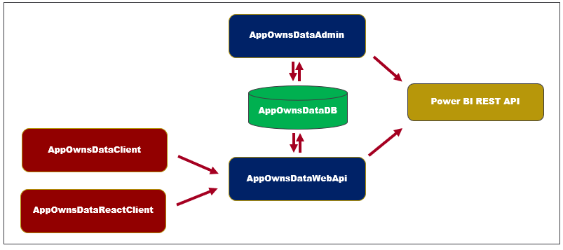

Let's begin with a brief description of the database and each of these
four web applications.

- **AppOwnsDataDB**: custom database to track tenants, user permissions
  and user activity

- **AppOwnsDataAdmin**: administrative app to create tenants and manage
  user permissions

- **AppOwnsDataWebApi**: custom Web API used by client-side SPA
  applications

- **AppOwnsDataClient**: customer-facing SPA developed using JQuery,
  Bootstrap, Typescript and webpack

- **AppOwnsDataReactClient** : customer-facing SPA developed using
  React-JS, Material UI, Typescript and webpack

Now, we'll look at each of these web applications in a greater detail.

### Understanding the AppOwnsDataAdmin application

The **AppOwnsDataAdmin** application is used by the hosting company to
manage its multi-tenant environment. The **AppOwnsDataAdmin**
application provides administrative users with the ability to create new
customer tenants. The **Onboard New Tenant** form of the
**AppOwnsDataAdmin** application allows you the specify the **Tenant
Name** along with the configuration settings to connect to a SQL Server
database with the customer's data.

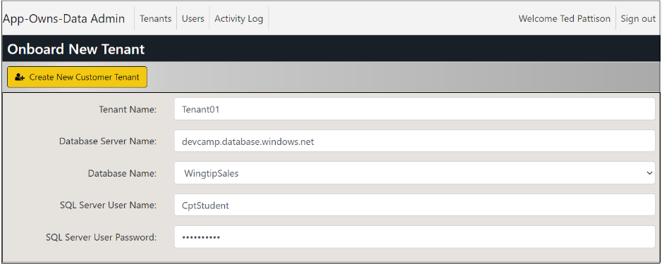

The App-Owns-Data Starter Kit demonstrates using the best practice of
creating and managing Power BI workspaces using ***service principal
profiles***. The key concept is that the **AppOwnsDataAdmin**
application has been programmed to create a new service principal
profile each time it needs to create a new customer tenant. After
creating a new service principal profile, the **AppOwnsDataAdmin**
application will then use that service principal profile to execute
Power BI REST API calls to create a new workspace and to populate it
with content. This provides a valuable degree of isolation as each
service principal profile is only given access to a single workspace for
one specific customer tenant.

When you click the **Create New Tenant** button, the
**AppOwnsDataAdmin** application responds by creating a new service
principal profile and then using that profile to execute Power BI REST
API calls to provision the new workspace. When the service principal
profile creates a new workspace, the service principal profile is
automatically included as workspace member in the role of Admin giving
it full control over anything inside the workspace. When creating a new
Power BI workspace, the **AppOwnsDataAdmin** application retrieves the
service principal ID and the new workspace ID and tracks them in a new
record in the **Tenants** table in the **AppOwnsDataDB** database.

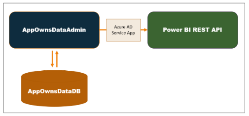

After creating a new Power BI workspace, the **AppOwnsDataAdmin**
application continues the tenant onboarding process by importing a
[template PBIX
file](https://github.com/PowerBiDevCamp/App-Owns-Data-Starter-Kit/raw/main/AppOwnsDataAdmin/wwwroot/PBIX/SalesReportTemplate.pbix)
to create a new dataset and report that are both named **Sales**. Next,
the tenant onboarding process updates two dataset parameters in order to
redirect the **Sales** dataset to the SQL Server database instance that
holds the customer's data. After that, the code patches the datasource
credentials for the SQL Server database and starts a refresh operation
to populate the **Sales** dataset with data from the customer's
database.

In the October 2022 updates, the logic in **AppOwnsDataAdmin** to
provision a new customer tenant was extended with the new logic to
deploy a paginated report from an RDL file template. The provisioning
logic imports the RDL file to create a paginated report named **Sales
Summary** and dynamically binds this paginated report to the **Sales**
dataset in the same workspace. The following screenshot shows a Power BI
workspace after the provisioning is complete.

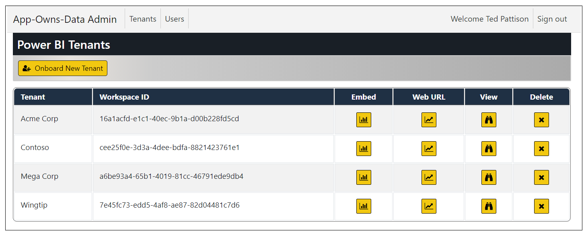

After creating customer tenants in the **AppOwnsDataAdmin** application,
these tenants can be viewed, managed or deleted from the **Customer
Tenants** page.

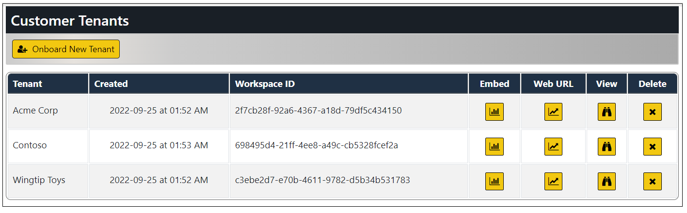

Let’s review how things work when you provision workspaces and content
with a service principal profile. If you execute a Power BI REST API as
a service principal profile to create a new workspace, that profile will
automatically be configured as a workspace member in the role of Admin.
If you execute a call as a service principal profile to import a PBIX
file and create a dataset, that profile will be configured as the
dataset owner. If you execute call as a service principal profile to set
datasource credentials, the profile will be configured as the owner of
the datasource credentials. As you can see, a service principal profile
has full control over any workspace it creates and everything inside.

Note both **AppOwnsDataAdmin** and **AppOwnsDataWebAPI** have been
programmed using service principal profiles. Given that
**AppOwnsDataAdmin** uses service principal profiles to provision
reports and datasets, the code in **AppOwnsDataWebAPI** must also use
service principal profiles to access that content. A full discussion of
developing with service principal profiles is beyond the scope of this
document. If you want to read up to gain a better understanding of why,
when and how to develop using service principal profiles, you should
read the article titled [The App-Owns-Data Multitenant
Application](https://github.com/PowerBiDevCamp/AppOwnsDataMultiTenant/raw/main/Docs/AppOwnsDataMultiTenant.pdf).

In addition to letting you create and manage customer tenants, the
**AppOwnsDataAdmin** application also makes it possible to manage users
and user permissions. The **Edit User** form provides administrative
users with a UI experience to assign users to a customer tenant. It also
makes it possible to configure the user permission assignment within a
customer tenant with a granularity of view permissions, edit permissions
and create permissions.

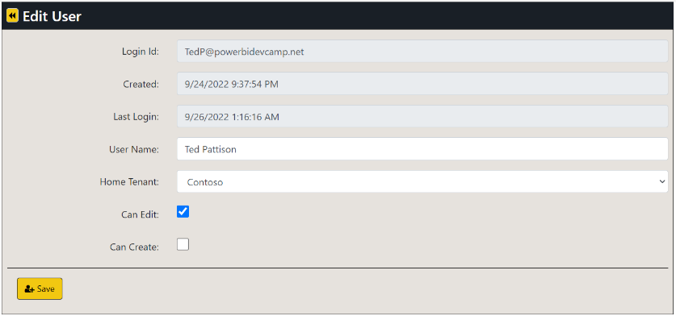

### Understanding the AppOwnsDataWebAPI application

When developing with App-Owns-Data embedding, it's a best practice to
authenticate with Azure AD as a service principal (as opposed to a user)
to acquire the access tokens for calling the Power BI Service API. This
requires an application to implement [Client Credentials
Flow](https://docs.microsoft.com/en-us/azure/active-directory/develop/v2-oauth2-client-creds-grant-flow)
to interact with Azure AD to acquire an app-only access token.

From an architectural viewpoint, code that uses Client Credentials Flow
should always be designed to run on a server in the cloud and never as
client-side code running in the browser. If you were to pass the Azure
AD access token for a service principal or the secrets used to
authenticate back to the browser, you would introduce a serious security
vulnerability in your design. An attacker that was able to capture the
Azure AD access token for a service principal would be able to call into
the Power BI REST API with full control over any workspace in which the
service principal is an Admin member.

When implementing App-Owns-Data embedding, you should never pass Azure
AD access tokens back to the browser. Instead, you should pass Power BI
**embed tokens** back to the browser to provide users with access to
Power BI reports and datasets. Unlike Azure AD access tokens, embed
tokens are generated by calling the Power BI REST API and not by
interacting with Azure AD.

Keep in mind that solutions using App-Owns-Data embedding are required
to implement a custom authorization policy. Given the architecture of
the App-Owns-Data Starter Kit, it’s the responsibility of
**AppOwnsDataWebApi** to generate embed tokens which reflect the correct
security policy for the current user. When generating an embed token,
there is code in **AppOwnsDataWebApi** which queries the **Users** table
in **AppOwnsDataDB** to inspect the current user’s profile and to
determine which report IDs, Dataset IDs and workspace IDs to include in
the embed token.

In the **App-Owns-Data Starter Kit** solution, both **AppOwnsDataAdmin**
and **AppOwnsDataWebApi** authenticate using the same Azure AD
application. That means that both applications can execute Power BI REST
API calls under the identity of the same service principal and the same
set of service principal profiles. This effectively provides
**AppOwnsDataWebApi** admin-level access to any Power BI workspaces that
have been created by **AppOwnsDataAdmin**.

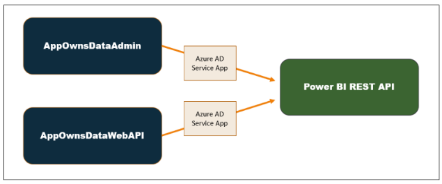

The client-side SPA applications **AppOwnsDataClient** and
**AppOwnsDataReactClient** have been designed as consumers of the Web
API exposed by **AppOwnsDataWebApi**. The security requirements for this
type of client-side SPA application involve integrating an identity
provider which makes it possible for users of **AppOwnsDataClient** and
**AppOwnsDataReactClient** to login and to make secure APIs calls to
**AppOwnsDataWebApi**.

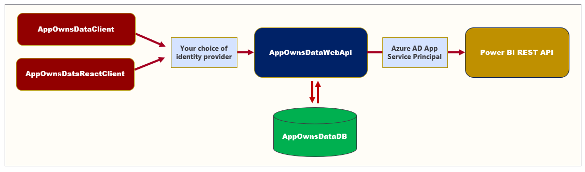

When developing with App-Owns-Data embedding, you have the flexibility
to use any authentication provide you’d like to authenticate end users
and to generate access tokens. In the case of the **App-Owns-Data
Starter Kit**, the identity provider being used to secure
**AppOwnsDataWebApi** is Azure AD. When the **AppOwnsDataClient**
application or the **AppOwnsDataReactClient** application executes an
API call on **AppOwnsDataWebApi**, it must pass an access token that's
been acquired from Azure AD.

When a client-side SPA executes a Web API operation,
**AppOwnsDataWebApi** is able validate the access token and determine
the user's login ID. Once **AppOwnsDataWebApi** determines the login ID
for the current user, it can then retrieve user profile data from
**AppOwnsDataDB** to determine what permissions have been assigned to
this user and to build the appropriate level of permissions into the
embed token returned to the client application.

The Azure AD application used by **AppOwnsDataClient** and
**AppOwnsDataReactClient** is configured to support organizational
accounts from any Microsoft 365 tenant as well as Microsoft personal
accounts for Skype and Xbox. You could take this further by using the
support in Azure AD for creating an Azure B2C Tenant. This would make it
possible to authenticate users with non-Microsoft identity providers
such as Google, Twitter and Facebook. Remember, a key advantage of
App-Owns-Data embedding is that you can use any identity provider you'd
like.

Now let's examine what goes on behind the scenes when a user launches a
client-side SPA such as the **AppOwnsDataClient** application. After the
user first authenticates with the identity provider, the
**AppOwnsDataClient** application calls to the **UserLogin** endpoint of
**AppOwnsDataWebApi** and passes the user's **LoginId** and
**UserName**. This allows **AppOwnsDataWebApi** to update the
**LastLogin** value for existing users and to add a new record in the
**Users** table of **AppOwnsDataDB** for any authenticated user who did
not previous have an associated record.

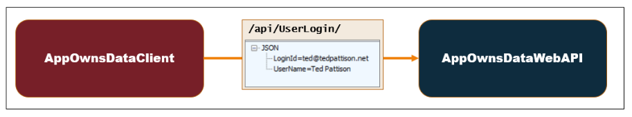

After the user has logged in, the **AppOwnsDataClient** application
calls the **Embed** endpoint to retrieve a view model which contains all
the data required for embedding reports from the user's tenant workspace
in Power BI. This view model includes an embed token which has been
generated to give the current user the correct level of permissions.

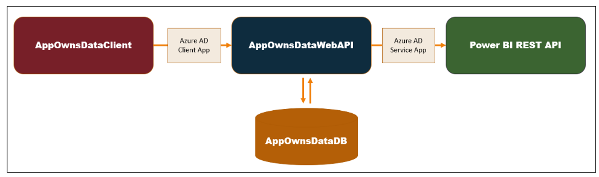

When a user logs in for the first time, **AppOwnsDataWebApi**
automatically adds a new record for the user to **AppOwnsDataDB**.
However, when users are created on the fly in this fashion, they are not
automatically assigned to any customer tenant. In this scenario where
the user is unassigned, **AppOwnsDataWebApi** returns a view model with
no embedding data and a blank tenant name. The **AppOwnsDataClient**
application responds to this view model with the following screen
notifying the user that they need to be assigned to a tenant before they
can begin to view reports.

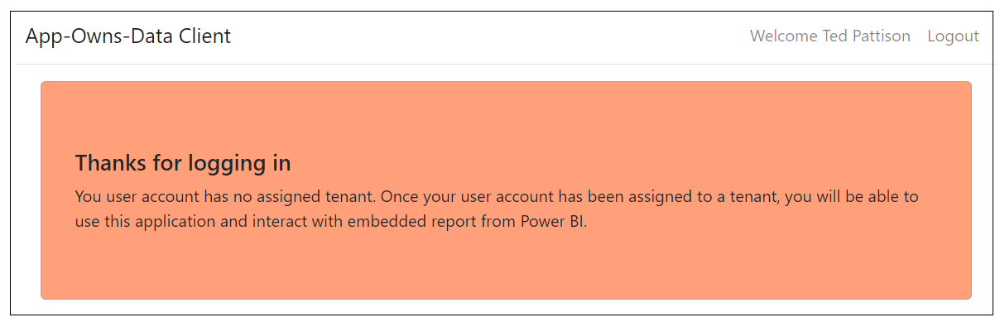

### Understanding the AppOwnsDataClient application

The **AppOwnsDataClient** application is the client-side SPA used by
customers to access embedded reports within a customer tenant. This
application has been created as a *single page application (SPA)* to
provide the best reach across different browsers and to provide a
responsive design for users accessing the application using a mobile
device or a tablet. The **AppOwnsDataClient** application demonstrates
how to create a SPA using HTML, CSS, JQuery, Bootstrap, MSAL.js,
TypeScript and webpack. Here is a screenshot of this application when
run in the full browser experience.

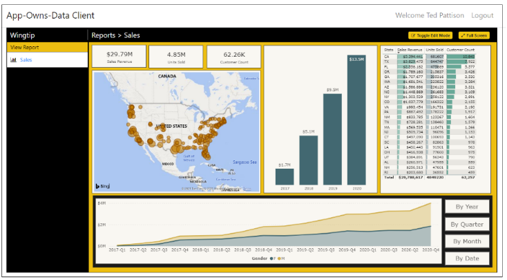

The **AppOwnsDataClient** application provides a report authoring
experience when it see the current user has edit permission or create
permissions. For example, the **AppOwnsDataClient** application displays
a **Toggle Edit Mode** button when it sees the current user has edit
permissions. This allows the user to customize a report using the same
report editing experience provided to SaaS users in the Power BI
Service. After customizing a report, a user with edit permissions can
save the changes using the **File \> Save** command.

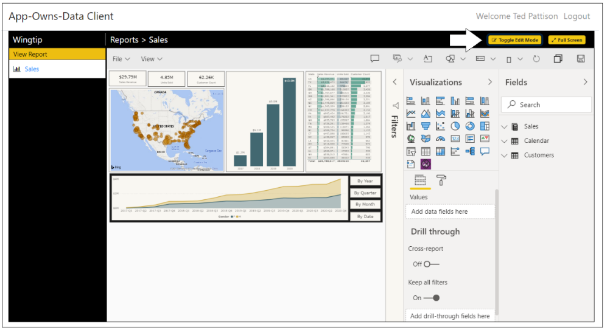

We live in an age where targeting mobile devices and tablets is a common
application requirement. The **AppOwnsDataClient** application was
created with a responsive design. The PBIX template file for the
**Sales** report provides a mobile view in addition to the standard
master view. There is client-side Typescript code in the
**AppOwnsDataClient** application which determines whether to display
the master view or the mobile view depending on the width of the hosting
device form factor. If you change the width of the browser window, you
can see the report transition between the master view and the responsive
view. The following screenshot shows what the **AppOwnsDataClient**
application looks like when viewed on a mobile device such as an iPhone.

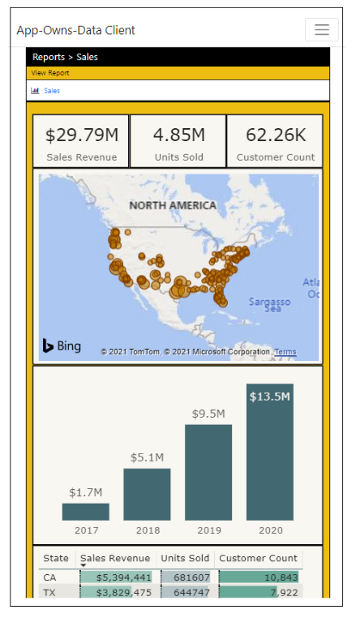

### Understanding the AppOwnsDataReactClient application

The **AppOwnsDataReactClient** application is the client-side SPA used
by end users to access embedded reports within a customer tenant. This
application is designed as a *single page application (SPA)* to provide
the best reach across different browsers and to provide a responsive
design. This application also demonstrates how to create a SPA using
modern React-JS, Material UI, MSAL.js, TypeScript and webpack. You
should also note that this application has been designed using the new
modern style in React-JS development which is based on functional
components and hooks as opposed to the classic style if React-JS
development based on class-based components and lifecycle methods.

Once the user has logged on, the **AppOwnsDataReactClient** application
makes calls across the network to the **Embed** endpoint to retrieve the
view model for the current user. If **AppOwnsDataReactClient** inspects
the view model and determines that this user has not yet been assigned
to a customer tenant, it displays the following message to the user.

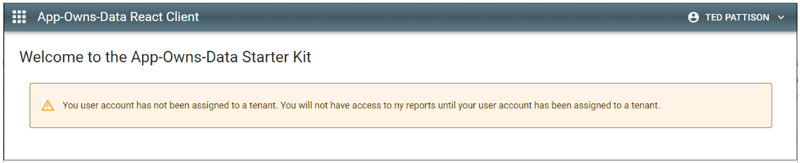

Once the user has been assigned to a customer tenant,
**AppOwnsDataReactClient** displays the home page shown in the following
screenshot. As you can see, this page displays the user name, login ID
and permissions as well as a list of the reports and datasets contained
in workspaces for the current customer tenant.

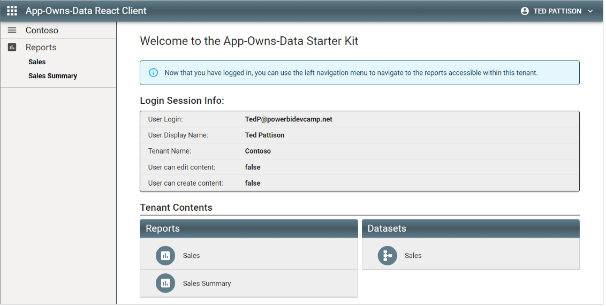

You can see that **AppOwnsDataReactClient** displays a left-hand
navigation menu allowing the user to navigate to any of the reports in
the current customer tenant. When a user clicks on a report in the
left-navigation menu, **AppOwnsDataReactClient** responds by embedding
the report using the Power BI JavaScript API.

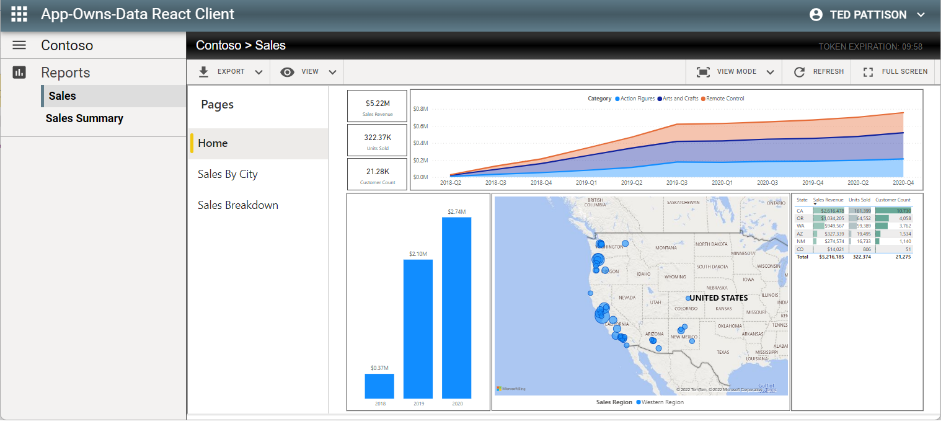

If the **AppOwnsDataReactClient** application determines the current
user has edit permission or create permissions, it provides a report
authoring experience making it possible to edit existing reports and to
create new reports. For example, the **AppOwnsDataReactClient**
application displays a **Edit** button when it sees the current user has
edit permissions. This allows the user to enter edit mode and customize
a report using the same report editing experience provided to SaaS users
in the Power BI Service.

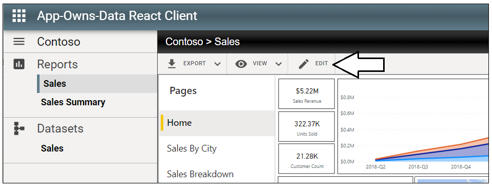

The following screenshot shows what a report looks like when the user
has moved it into edit mode. After customizing a report, a user with
edit permissions can save the changes using the **File \> Save**
command. A user with create permissions also has the option of saving
changes using the **File \> Save As** command which will clone of a copy
of the existing report.

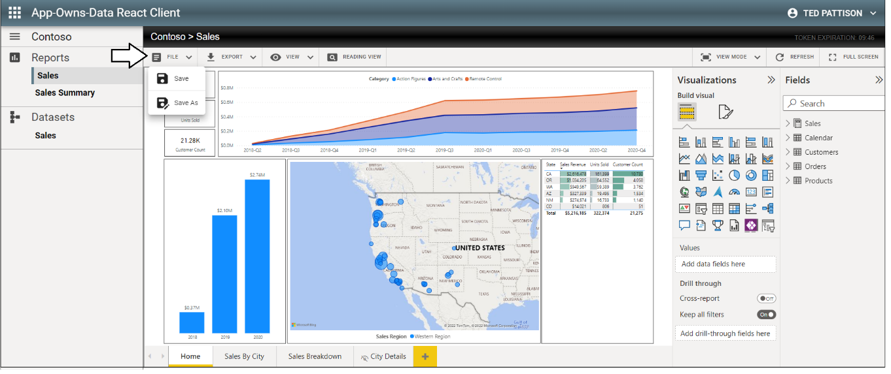

### Designing a custom telemetry layer

A valuable aspect of the **App-Owns-Data Starter Kit** architecture is
that it adds its own custom telemetry layer. The **AppOwnsDataClient**
application and the **AppOwnsDataReactClient** application have been
designed to call the **ActivityLog** endpoint of **AppOwnsDataWebApi**
whenever there is user activity that needs to be monitored.

**AppOwnsDataWebApi** responds to calls to the **ActivityLog** endpoint
by creating a new record in the **ActivityLog** table in
**AppOwnsDataDB** to record the user activity. This makes it possible to
monitor user activity such as viewing reports, editing reports, creating
reports and copying reports.

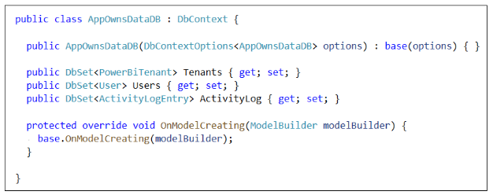

Given the architecture of this custom telemetry layer, it's now possible
to see all user activity for report viewing and report authoring by
examining the records in the **ActivityLog** table.

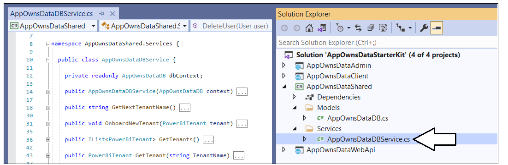

The **AppOwnsDataAdmin** application provides an **Activity Log** page
which makes it possible to examine the most recent activity events that
have occurred.

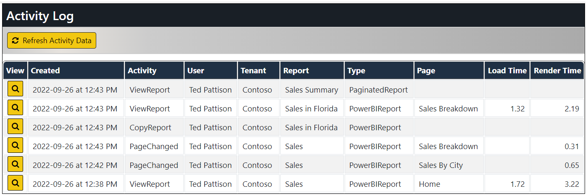

In addition to capturing usage data focused on user activity, this
telemetry layer also captures performance data which makes it possible
to monitor how fast reports are loaded and rendered in the browser. This
is accomplished by adding client-side code using the Power BI JavaScript
API which records the load duration and the render duration anytime it
embeds a report. This makes it possible to monitor report performance
across a multi-tenant environment to see if any reports require
attention due to slow loading and rendering times.

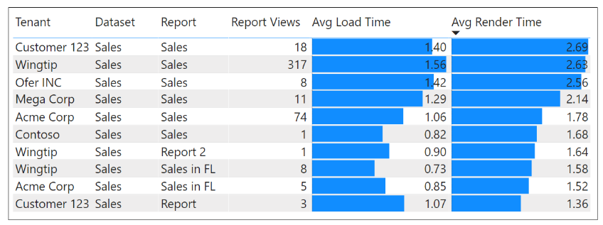

Many developer who are beginning to develop with App-Owns-Data embedding
spend time trying to figure out how to monitor user activity by using
the [Power BI activity
log](https://docs.microsoft.com/en-us/power-bi/admin/service-admin-auditing)
which is automatically generated by the Power BI Service. However, this
is not as straightforward as one might expect when developing with
App-Owns-Data embedding. What happens in the scenario when a report is
embedded using an embed token generated by a service principal or a
service principal profile? In this scenario, the Power BI activity log
does not record the name of the actual user. Instead, the Power BI
activity logging service adds the Application ID of the service
principal as the current user. Unfortunately, that doesn't provide
useful information with respect to user activity.

In order to map user names in an App-Owns-Data embedding scenario to
events in the Power BI activity log, there is extra work required. When
you embed a report with client-side code in the browser, it's possible
to capture a ***correlation ID*** which maps back to the request ID for
an event in the Power BI activity log. The idea is that you can map the
correlation ID and the current user name back to a request ID in the
Power BI activity log. However, that takes more work and this extra
effort doesn't really provide any additional usage data beyond what
being recorded with the custom telemetry layer that is demonstrated in
the **App-Owns-Data Starter Kit** solution.

At this point, you might ask yourself whether it's important to
integrate the Power BI activity log into a solution that uses
App-Owns-Data embedding. The answer is no. It becomes unnecessary to
integrate the Power BI Activity log once you have created your own
custom telemetry layer. Furthermore, it usually take about 15 minutes
for activity to show up in the Power BI activity log. Compare this to a
custom telemetry layer where usage data is available immediately after
an event has been logged by the **AppOwnsDataClient** application or the
**AppOwnsDataReactClient**.

### Understanding the AppOwnsDataShared class library project

The **AppOwnsDataDB** database is built using the .NET 6 version of the
Entity Framework known as [Entity Framework
Core](https://docs.microsoft.com/en-us/ef/core/). Entity Framework
supports the ***Code First*** approach where the developer starts by
modeling database tables using classes defined in C#. The Code First
approach has advantages while you're still in the development stage
because it’s very easy to change the database schema in your C# code and
then apply those changes to the database.

The C# code which creates and accesses the **AppOwnsDataDB** database is
included in a class library project named **AppOwnsDataShared**. By
adding the Entity Framework code to a class library project, it can be
shared across the two web application projects for **AppOwnsDataAdmin**
and **AppOwnsDataWebApi**.

One import thing to keep in mind is that the **AppOwnsDataShared**
project is a class library which cannot have its own configuration file.
Therefore, the connection string for the **AppOwnsDataDB** database is
tracked in project configuration files for both **AppOwnsDataAdmin** and
**AppOwnsDataWebApi**.

The **Tenants** table in **AppOwnsDataDB** is generated by a C# class
named **PowerBITenant**.

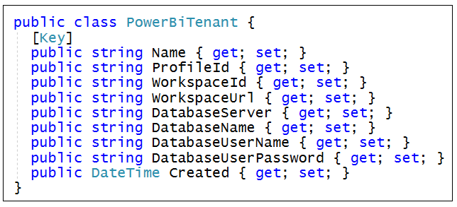

The **Users** table is generated using the table schema defined by
the **User** class.

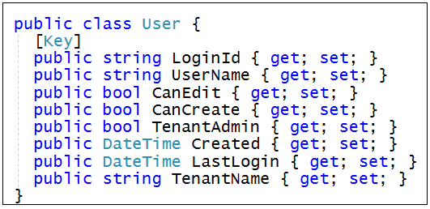

The **ActivityLog** table is generated using the table schema defined by
the **ActivityLogEntry** class.

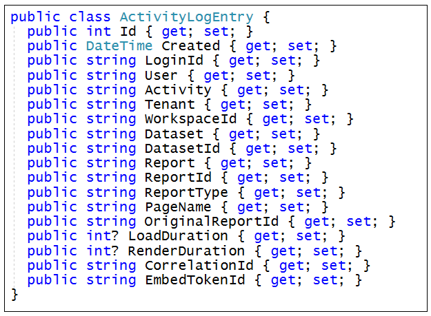

The database model itself is created by the **AppOwnsDataDB** class
which derives from **DbContext**.

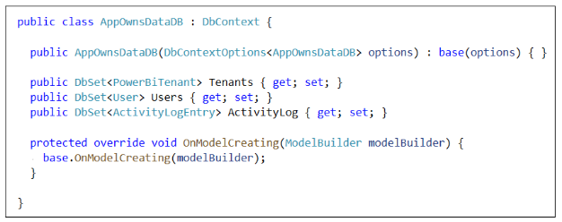

The **AppOwsDataShared** project contains a public class named
**AppOwnsDataDbService** which contains all the shared logic to execute
read and write operations on the **AppOwnsDataDB** database. The
**AppOwnsDataAdmin** application and **AppOwnsDataWebApi** both access
**AppOwnsDataDB** by calling public methods in the
**AppOwnsDataDbService** class.

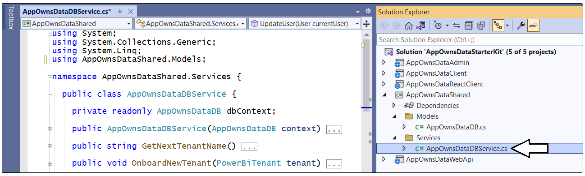

## Set up your development environment

This section provides a step-by-step guide for setting up
the **App-Owns-Data Starter Kit** solution for testing. To complete
these steps, you will require a Microsoft 365 tenant in which you have
permissions to create and manage Azure AD applications and security
groups. You will also need Power BI Service administrator permissions to
configure Power BI settings to give the service principal for an Azure
AD application to ability to access the Power BI REST API. If you do not
have a Microsoft 365 environment for testing, you can create one for
free by following the steps in [Create a Development Environment for
Power BI
Embedding](https://github.com/PowerBiDevCamp/Camp-Sessions/raw/master/Create%20Power%20BI%20Development%20Environment.pdf).

To set up the  **App-Owns-Data Starter Kit** solution for testing, you
will need to configure a Microsoft 365 tenant by completing the
following tasks.

- Create an Azure AD security group named **Power BI Apps**

- Configure Power BI tenant-level settings for service principal access

- Create the Azure AD Application named **App-Owns-Data Service App**

- Create the Azure AD Application named **App-Owns-Data Client App**

The following four sections will step through each of these setup tasks
in step-by-step detail.

### Create an Azure AD security group named Power BI Apps

Navigate to the [Groups management
page](https://portal.azure.com/#blade/Microsoft_AAD_IAM/GroupsManagementMenuBlade/AllGroups) in
the Azure portal. Once you get to the **Groups** page in the Azure
portal, click the **New group** link.

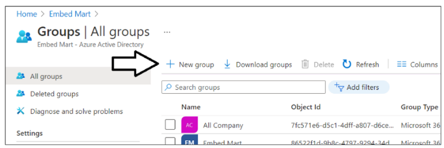

In the **New Group** dialog, Select a **Group type** of **Security** and
enter a **Group name** of **Power BI Apps**. Click the **Create** button
to create the new Azure AD security group.

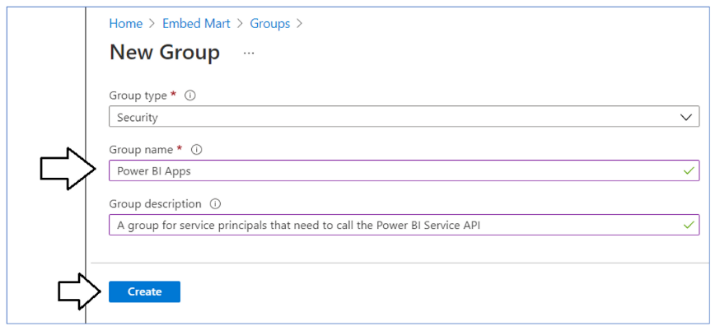

Verify that you can see the new security group named **Power BI
Apps** on the Azure portal **Groups** page.

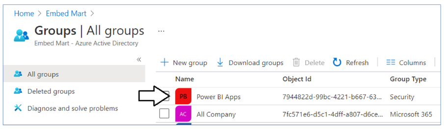

### Configure Power BI tenant-level settings for service principal access

Next, you need you enable a tenant-level setting named **Allow service
principals to use Power BI APIs**. Navigate to the Power BI Service
admin portal at <https://app.powerbi.com/admin-portal>. In the Power BI
Admin portal, click the **Tenant settings** link on the left.

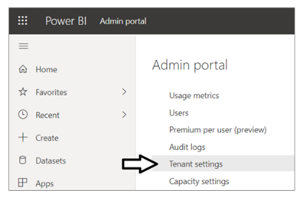

Move down to **Developer settings**  and expand **Allow service
principals to use Power BI APIs** section.

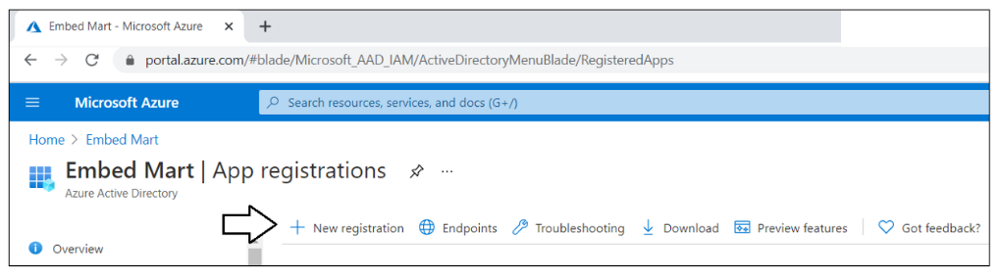

Note that the **Allow service principals to use Power BI APIs** setting
is initially set to **Disabled**.

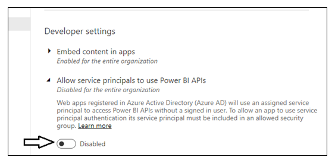

Change the setting to **Enabled**. After that, set the **Apply
to** setting to **Specific security groups** and add the **Power BI
Apps** security group as shown in the screenshot below. Click
the **Apply** button to save your configuration changes.

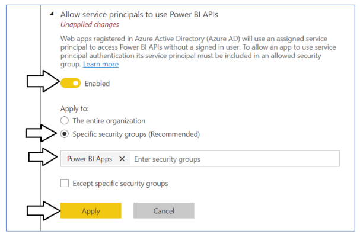

You will see a notification indicating it might take up to 15 minutes to
apply these changes to the organization.

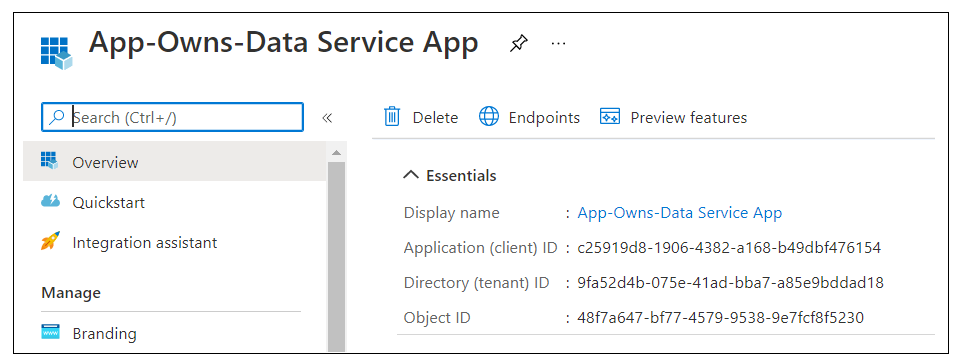

Now, move down a little further in the **Developer settings** section
and expand the node for the setting named **Allow service principals to
create and use profiles**. You must enable this setting in your Power BI
tenant in order for code in the **App-Owns-Data Starter Kit** to program
using service principal profiles to create workspaces and populate them
with content.

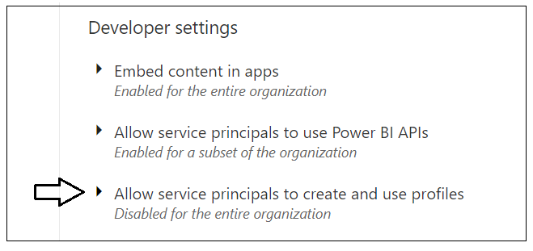

Enable the **Allow service principals to create and use profiles**
setting. After that, set the **Apply to** setting to **Specific security
groups** and add the **Power BI Apps** security group as shown in the
screenshot below. Click the **Apply** button to save your configuration
changes.

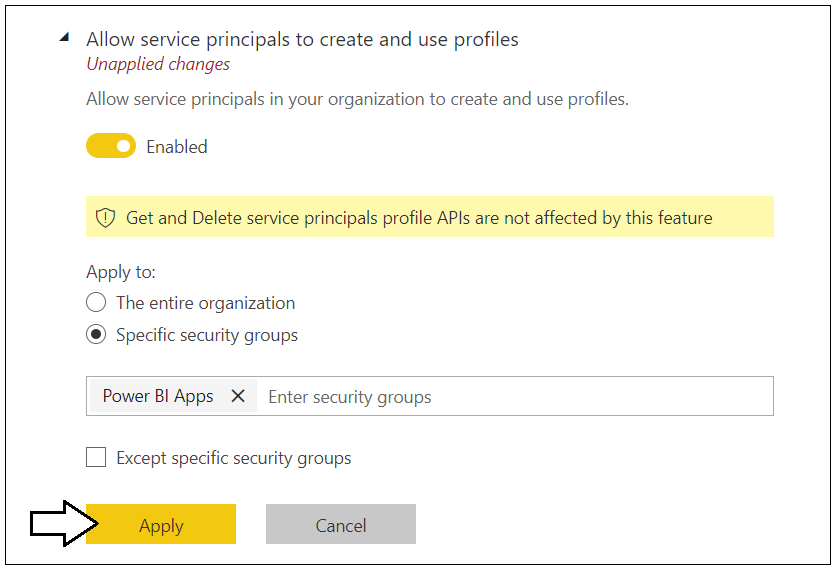

Now scroll upward in the **Tenant setting** section of the Power BI
admin portal and locate **Workspace settings**.

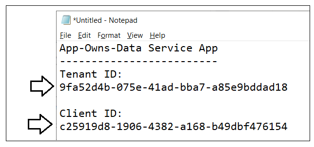

Note that a new Power BI tenant has an older policy where only users who
have the permissions to create Office 365 groups can create new Power BI
workspaces. You must reconfigure this setting so that service principals
in the **Power BI Apps** group will be able to create new workspaces.

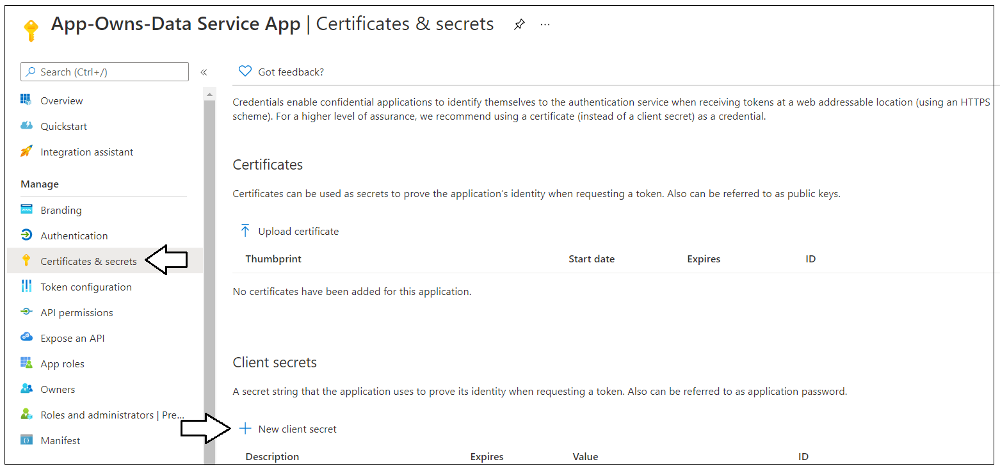

In **Workspace settings**, set **Apply to** to **Specific security**
groups, add the **Power BI Apps** security group and click
the **Apply** button to save your changes.

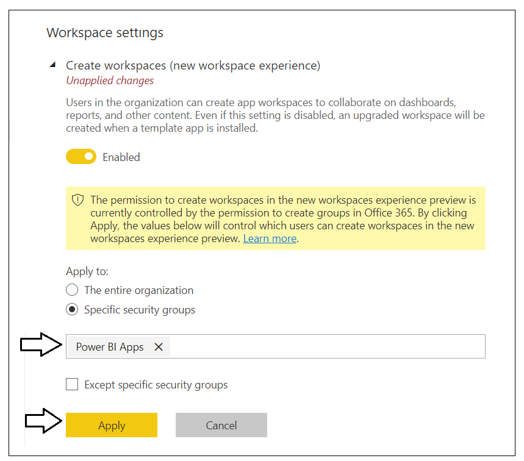

You have now completed the configuration of the required Power BI
tenant-level settings.

### Create the **App-Owns-Data Service App in Azure AD**

Navigate to the [App
registration](https://portal.azure.com/#blade/Microsoft_AAD_IAM/ActiveDirectoryMenuBlade/RegisteredApps) page
in the Azure portal and click the **New registration** link.

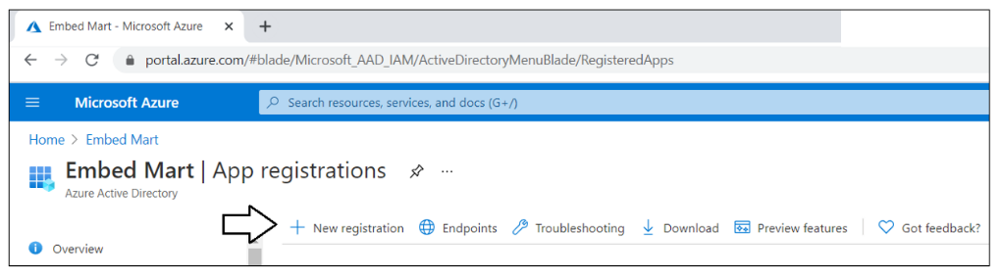

On the **Register an application** page, enter an application name of
**App-Owns-Data Service App** and accept the default selection
for **Supported account types** of **Accounts in this organizational
directory only**.

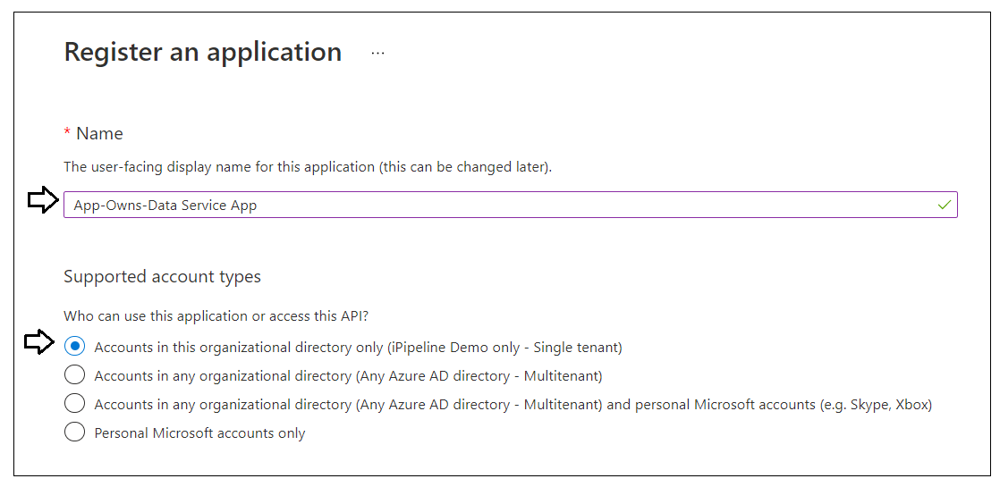

Complete the following steps in the **Redirect URI** section.

- Leave the default selection of **Web** in the dropdown box

- Enter a **Redirect URI** of <https://localhost:44300/signin-oidc>

- Click the **Register** button to create the new Azure AD application.

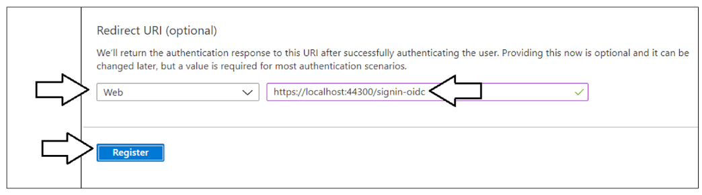

After creating a new Azure AD application in the Azure portal, you
should see the Azure AD application overview page which displays
the **Application ID**. Note that the ***Application ID*** is often
called the ***Client ID***, so don't let this confuse you. You will need
to copy this Application ID and store it so you can use it later to
configure the support acquiring app-only access tokens from Azure AD
using for Client Credentials Flow.

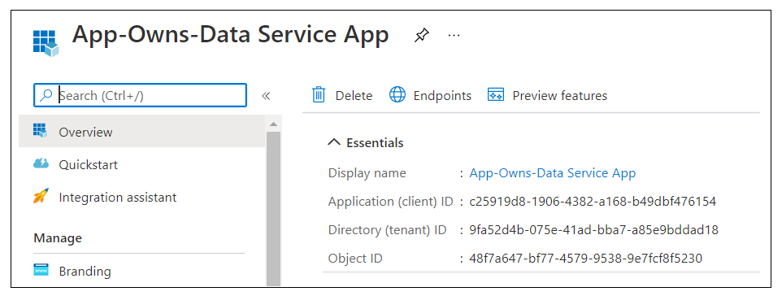

Copy the **Client ID** (aka Application ID) and paste it into a text
document so you can use it later in the setup process. Note that
this **Client ID** value will be used by both the
**AppOwnsDataAdmin** project and the **AppOwnsDataWebApi** project to
configure authentication for the service principal with Azure AD.

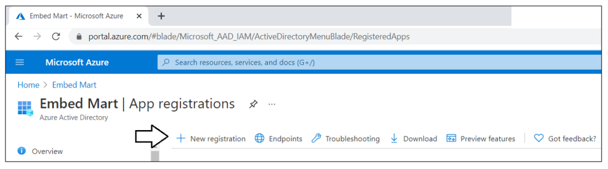

Next, repeat the same step by copying the **Tenant ID** and copying that
into the text document as well.

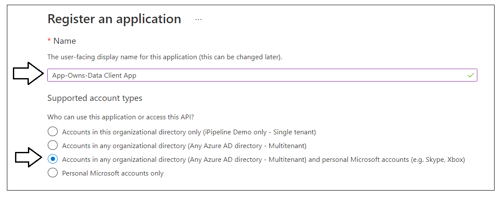

Your text document should now contain the **Client ID** and **Tenant
ID** as shown in the following screenshot.

Next, you need to create a Client Secret for the application. Click on
the **Certificates & secrets** link in the left navigation to move to
the **Certificates & secrets** page. On the **Certificates &
secrets** page, click the **New client secret** button as shown in the
following screenshot.

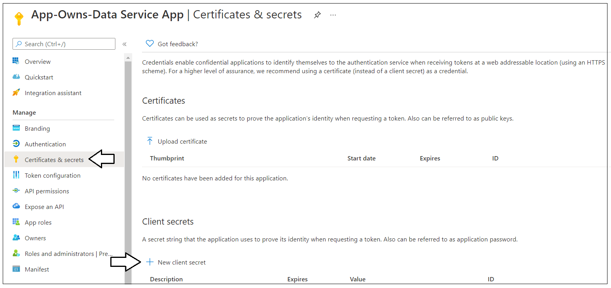

In the **Add a client secret** dialog, add a **Description** such
as **Test Secret** and set **Expires** to any value you'd like from the
dropdown list. Click the **Add** button to create the new Client Secret.

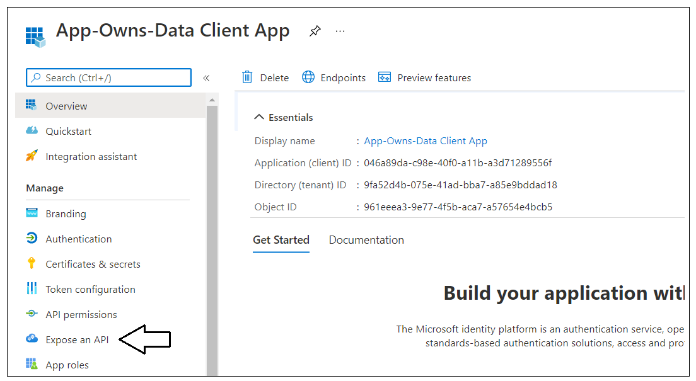

Once you have created the Client Secret, you should be able to see
its **Value** in the **Client secrets** section. Click on the **Copy to
clipboard** button to copy the **Value** for the Client Secret into the
clipboard.

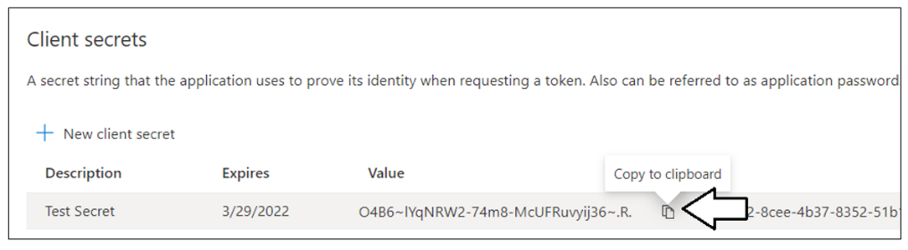

Paste the **Client Secret** into the same text document with
the **Client ID** and **Tenant ID**.

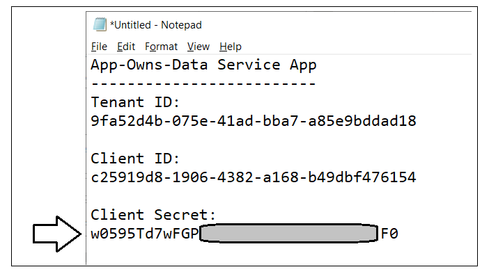

The last thing is to add the service principal for this app to Azure AD
Security group named **Power BI Apps**.

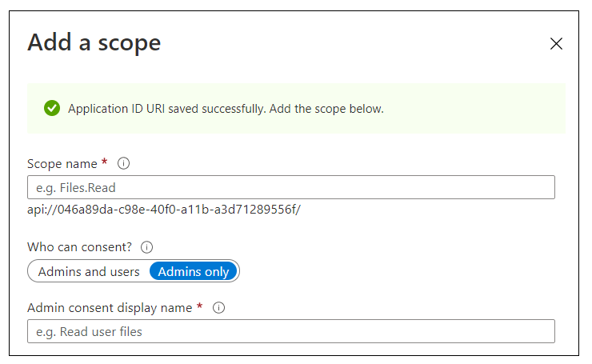

Navigate to the **Members** page for the **Power BI Apps** security
group using the **Members** link in the left navigation. Add the Azure
AD application named **App-Owns-Data Service App** as a group member.

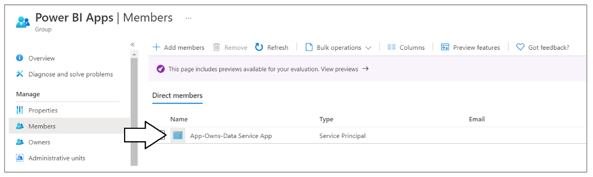

You have now completed the registration of the Azure AD application
named **App-Owns-Data Service App**. This is the Azure application that
will be used to authenticate as a service principal in order to call the
Power BI REST API. The **App-Owns-Data Service App** will also be used
to authenticate administrative users who need to use the
**AppOwnsDataAdmin** application.

In the next section, you will create a new Azure AD application named
**App-Owns-Data Client App**. This Azure AD application will be used to
secure the custom web API exposed by **AppOwnsDataWebApi**. The
**AppOwnsDataClient** application and the **AppOwnsDataReactClient**
application will both be configured to use this Azure AD application to
authenticate users and to acquire access tokens in the browser so they
can execute secure API calls on **AppOwnsDataWebApi**.

### Create the **App-Owns-Data Client App in Azure AD**

Navigate to the [App
registration](https://portal.azure.com/#blade/Microsoft_AAD_IAM/ActiveDirectoryMenuBlade/RegisteredApps) page
in the Azure portal and click the **New registration** link.

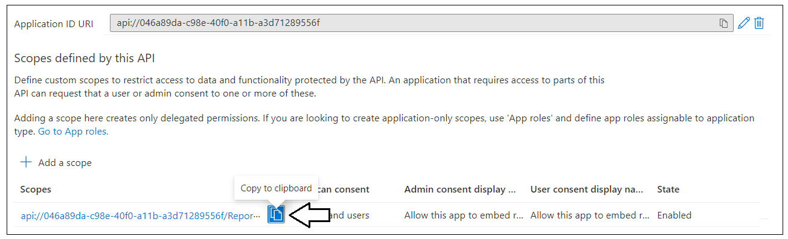

On the **Register an application** page, enter an application name of
**App-Owns-Data Client App** and change **Supported account
types** to **Accounts in any organizational directory and personal
Microsoft accounts**.

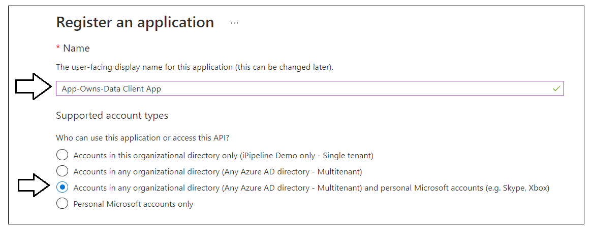

Complete the following steps in the **Redirect URI** section.

1.  Change the setting of the dropdown box to **Single page application
    (SPA)**

2.  Enter a **Redirect URI** of <https://localhost:44301/>.

3.  Click the **Register** button to create the new Azure AD
    application.

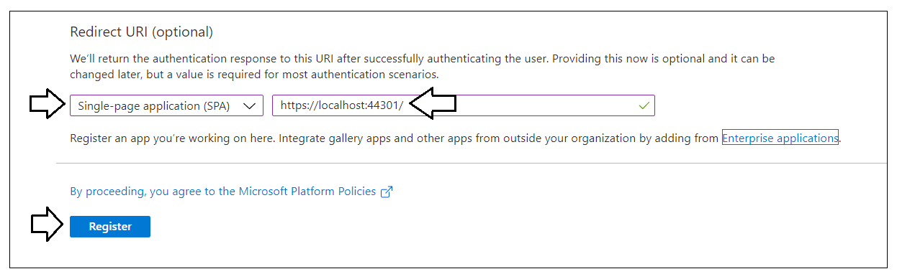

After creating a new Azure AD application in the Azure portal, you
should see the Azure AD application overview page which displays
the **Application ID**. Copy the **Client ID** (aka Application ID) and
paste it into a text document so you can use it later in the setup
process. Note that this **Client ID** value will be used in the
**AppOwnsDataWebApi** project, the **AppOwnsDataClient** project and the
**AppOwnsDataReactClient** project to configure authentication with
Azure AD.

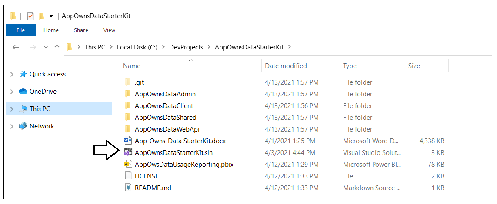

The **App-Owns-Data Client App** will be used to secure the API
endpoints of **AppOwnsDataWebApi**. When creating an Azure AD
application to secure a custom Web API like this, it is necessary to
create a custom scope for a delegated permission. As a developer, you
can create a new custom scope using any name you'd like. In the solution
for the **App-Owns-Data Starter Kit**, the custom scope will be given a
name of **Reports.Embed**.

On the summary page for **App-Owns-Data Client App**, click the **Expose
an API** link in the left navigation.

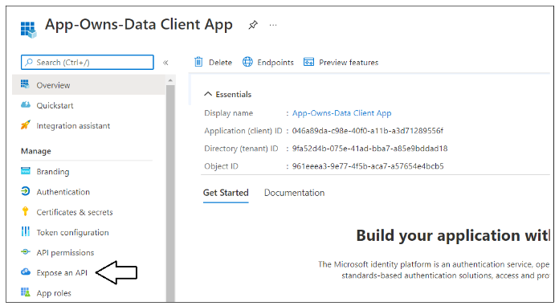

On the **Expose an API** page, click the **Add a scope** button.

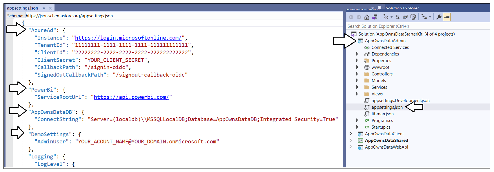

On the **Add a scope** pane, you will be prompted to set an
**Application ID URI** before you will be able to create a new scope.
Click **Save and continue** to accept the default setting of **api://**
followed the application ID.

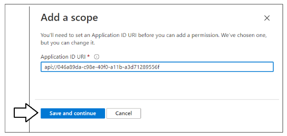

The **Add a scope** pane should now present a form to enter data for the
new scope.

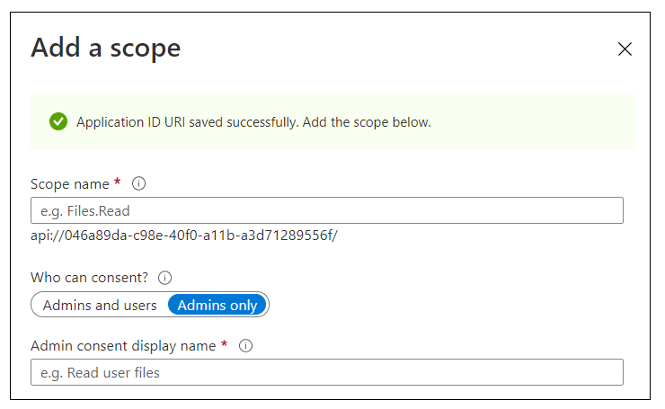

Fill out the data in the **App a scope** pane using these steps.

1.  Add a **Scope name** of **Reports.Embed**.

2.  For the **Who can consent** setting, select **Admins and users**.

3.  Fill in all display names and descriptions using the text shown in
    the following screenshot.

4.  Click the **Add scope** button.

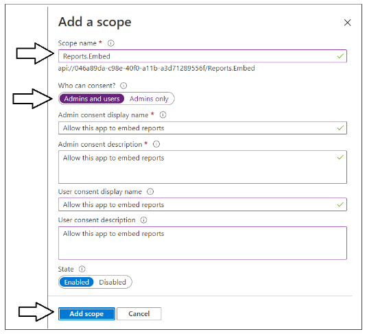

You should now see the new scopes in the **Scopes defined by this API**
section. If you copy the scope value to the clipboard, you will see that
is created in the format of
**api://**\[ApplicationID\]**/Reports.Embed**.

### Developing and Testing with a Dedicated Capacity

While it is not an absolute requirement, it is recommended that you work
with the App-Owns-Data Starter Kit in a Power BI environment with a
dedicated capacity created with either Power BI Premium (P SKU) or Power
BI Embedded (A SKU). If you do not have a dedicated capacity, there are
several issues that will affect your experience when working with the
App-Owns-Data Starter Kit. First, the Power BI Service will add the
following label when it embeds a Power BI report.

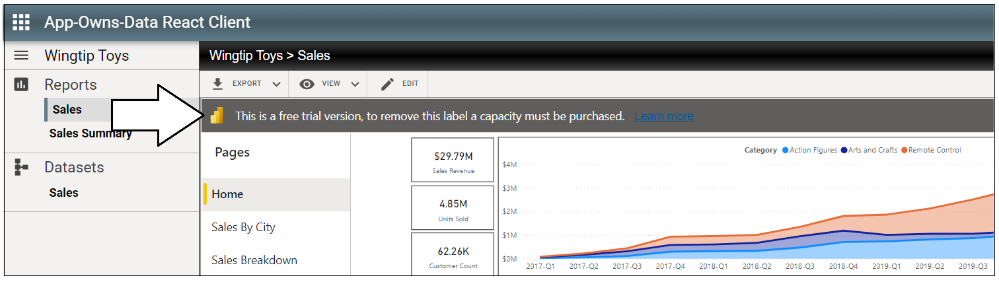

The second issue is that you will not be able to use paginated reports
because the use of paginated reports requires a dedicated capacity. If
you don’t configure **AppOwnsDataAdmin** with a **TargetCapacityId**,
the workspaces created for customer tenants will not include the
paginated report named **Sales Summary**.

The third issue is that the Power BI REST API for exporting reports is
not available in the shared capacity. Therefore, a user’s attempt to
export a report will fail. You will not be able to test the menu
commands in **AppOwnsDataReactClient** for exporting reports.

The final issue is that the Power BI Service gives each service
principal a finite quota for how many embed tokens it can create for
reports in the shared capacity. Once the quota of embed tokens has been
used up for a service principal, further attempts to generate embed
tokens for reports in the shared capacity will fail. One way to remedy
this problem is to create a new Azure AD application to create a new
service principal which gets its own new quota of embed tokens.

As you can see, working with the App-Owns-data Starter Kit will be
better if you have a dedicated capacity. If you have a dedicated
capacity you can use, you will need to find its GUID-based ID so you can
add it to the configuration data for **AppOwnsDataAdmin**. One easy way
to find this ID is to is by navigating to the **Capacity setting**
section of the **Power BI Admin portal**. If you select a specific
capacity to see its settings, you can copy the capacity ID from the
address bar in the browser.

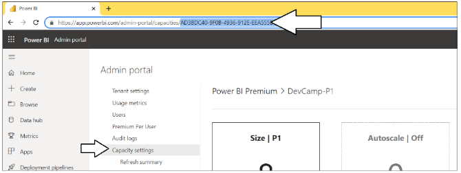

One final issue is that the service principal you use will need
**Contributor permissions** on this dedicated capacity so that it can
associate new workspaces. You can configure the permissions you need by
configuring the Azure AD group named **Power BI Apps** with
**Contributor permissions** as shown in the following screenshot.

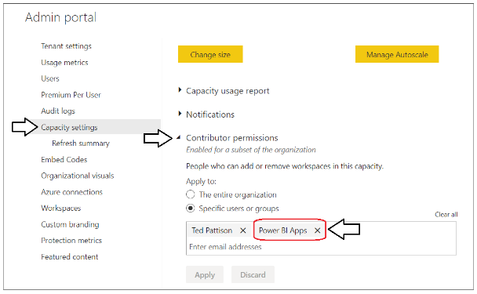

## Open the App-Owns-Data Starter Kit solution in Visual Studio 2022

In order to run and test the **App-Owns-Data Starter Kit** solution on a
developer workstation, you must install the .NET 6 SDK, Node.js and
Visual Studio 2022. While this document will walk through the steps of
opening and running the projects of the **App-Owns-Data Starter Kit**
solution using Visual Studio 2022, you can also use Visual Studio Code
if you prefer that IDE. Here are links to download this software if you
need them.

- .NET 6 SDK –
  \[[download](https://dotnet.microsoft.com/download/dotnet/5.0)\]

- Node.js – \[[download](https://nodejs.org/en/download/)\]

- Visual Studio 2022 –
  \[[download](https://visualstudio.microsoft.com/downloads/)\]

- Visual Studio Code –
  \[[download](https://code.visualstudio.com/Download)\]

### Download the source code

The project source files for the **App-Owns-Data Starter Kit** solution
are maintained in a GitHub repository at the following URL.

<https://github.com/PowerBiDevCamp/App-Owns-Data-Starter-Kit>

On the home page for this GitHub repository is the **Code** dropdown
menu which provides a few options for downloading the source files to
your local machine.

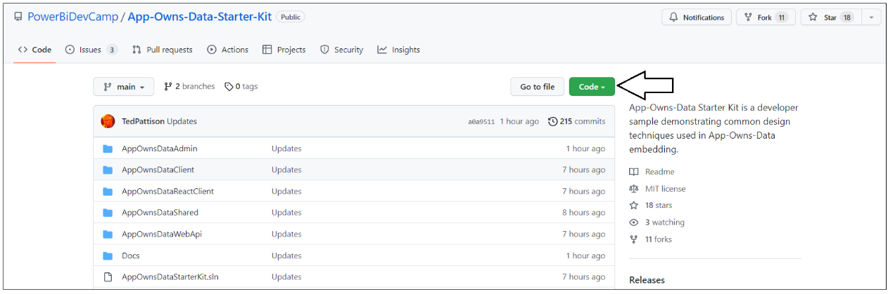

You can download the **App-Owns-Data Starter Kit** project source files
in a single ZIP archive using [this
link](https://github.com/PowerBiDevCamp/App-Owns-Data-Starter-Kit/archive/refs/heads/main.zip).

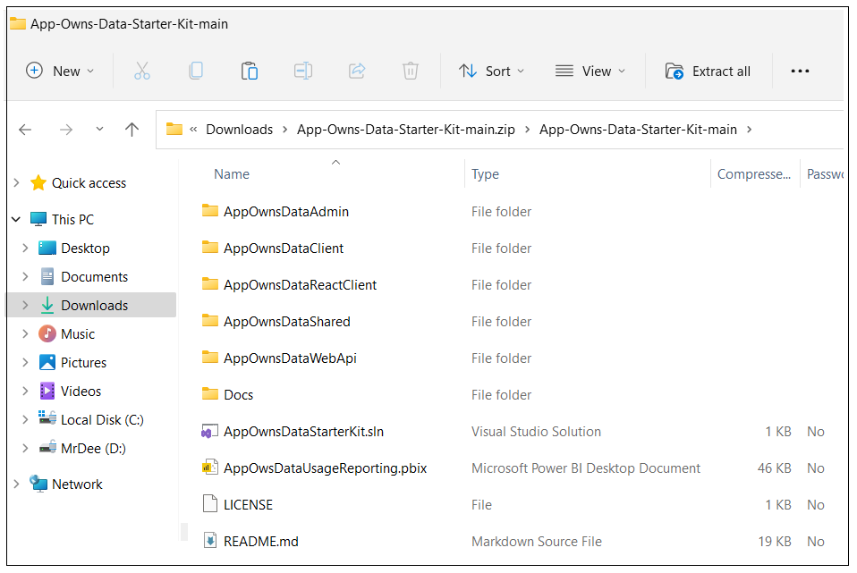

If you are familiar with the **git** utility, you can clone the project
source files to your local developer workstation using the
following **git** command:

**git clone
https://github.com/PowerBiDevCamp/App-Owns-Data-Starter-Kit.git**

Once you have downloaded the project source files for
the **App-Owns-Data Starter Kit** solution to your developer
workstation, you will see there is a top-level solution folder which
contains folders for four projects named **AppOwnsDataAdmin**,
**AppOwnsDataClient**, **AppOwnsDataReactClient**, **AppOwnsDataShared**
and **AppOwnsDataWebApi**. You can open the Visual Studio solution
containing all four projects by double-clicking the solution file named
**AppOwnsDataStarterKit.sln**.

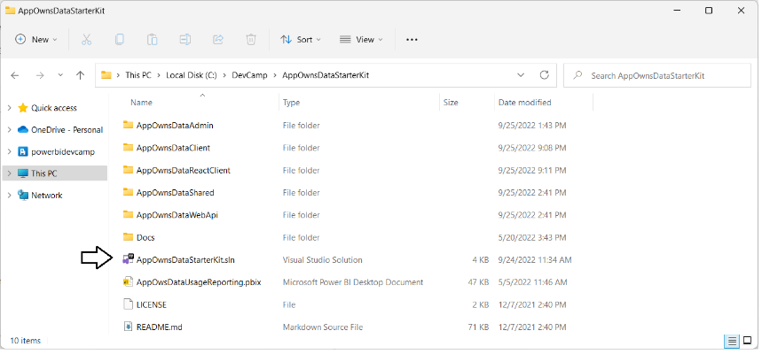

### Open AppOwnsDataStarterKit.sln in Visual Studio 2022

Launch Visual Studio 2022 and use the **File \> Open \>
Project/Solution** menu command to open the solution file
named **AppOwnsDataStarterKit.sln**. You should see the five projects
named **AppOwnsDataAdmin**, **AppOwnsDataClient**,
**AppOwnsDataReactClient**, **AppOwnsDataShared** and
**AppOwnsDataWebApi**.

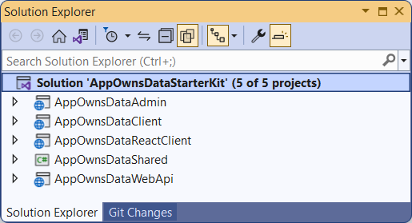

Here is a brief description of each of these projects.

- **AppOwnsDataAdmin**: ASP.NET MVC Web Application built using .NET 6

- **AppOwnsClient**: SPA application built using HTML, CSS, JQuery,
  Bootstrap, Typescript and webpack

- **AppOwnsReactClient**: SPA application built using React-JS, Material
  UI and Typescript and webpack

- **AppOwnsDataShared**: Class library project used to generate and
  access **AppOwnsDataDB**

- **AppOwnsDataWebApi**: ASP.NET Web API which exposes secure web
  services to SPA client applications

### Update the appsettings.json file of AppOwnsDataAdmin project

Before you can run the **AppOwnsDataAdmin** application in the Visual
Studio debugger, you must update several application settings in
the **appsettings.json** file. Open **appsettings.json** and examine the
JSON content inside. There is four important sections
named **AzureAd**, **PowerBi, AppOwnsDataDB** and **DemoSettings**.

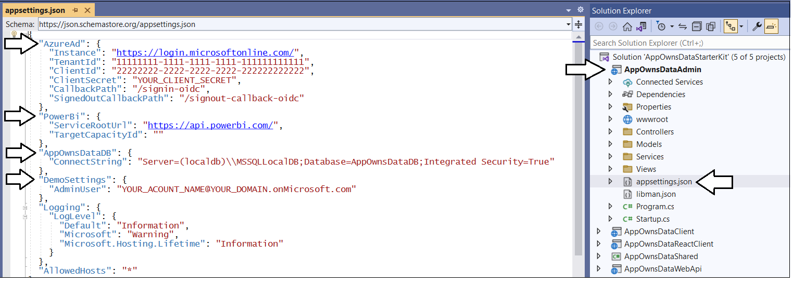

Inside the **AzureAd** section, update
the **TenantId**, **ClientId** and **ClientSecret** with the data you
collected when creating the Azure AD application named **App-Owns-Data
Service App.**

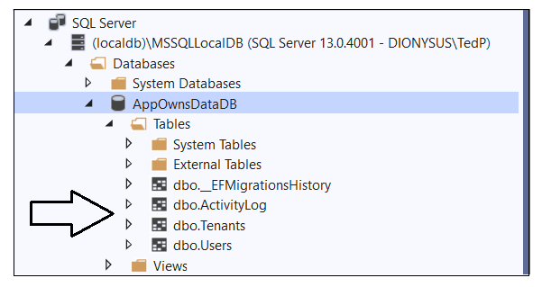

The **PowerBi** section contains a property named **ServiceRootUrl**.
You do not have to modify this value if you are using Power BI in the
public cloud as most companies do. If you are using Power BI in one of
the government clouds or in the Microsoft clouds for Germany or China,
this URL must be updated appropriately.

The **PowerBi** section contains a second property named
**TargetCapacityId**. If you are working in a Power BI environment with
dedicated capacities, you can enter the ID for that capacity here and
the **AppOwnsDataAdmin** application will automatically associated each
workspace it creates with this dedicated capacity. If you leave
**TargetCapacityId** as an empty string, the **AppOwnsDataAdmin**
application will ignore the setting and all the workspaces created will
remain in the shared capacity.

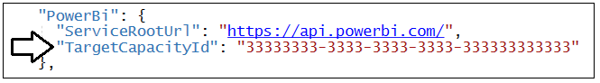

If you are using Visual Studio 2022, you should be able leave the
database connection string the way it is with the **Server** setting
of **(localdb)\\\MSSQLLocalDB**. You can change this connection string
to a different SQL Server instance if you'd rather create the project
database named **AppOwnsDataDB** in a different location.

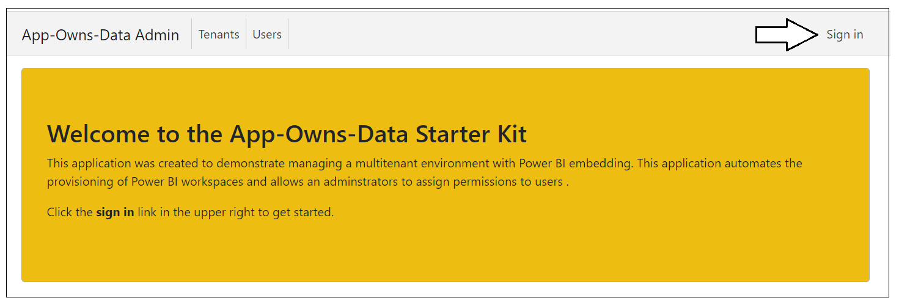

In the **DemoSettings** section there is a property named **AdminUser**.
The reason that this property exists has to do with you being able to
see Power BI workspaces as they are created by a service principal.
There is code in the **AppOwnsDataAdmin** application that will add the
user specified by the **AdminUser** setting as a workspace admin any
time a new Power BI workspace is created. This support has been included
to make things much easier for you to see what's going on when you begin
to run and test the application.

Update the **AdminUser** setting with the Azure AD account name you're
using in your test environment so that you will be able to see all the
Power BI workspaces created by the **AppOwnsDataAdmin** application.

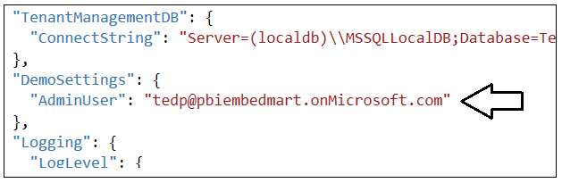

### Create the **AppOwnsDataDB** database

Before you can run the application in Visual Studio, you must create the
database named **AppOwnsDataDB**. This database schema has been created
using the .NET 6 version of the Entity Framework. In this step, you will
execute two PowerShell cmdlets provided by Entity Framework to create
the database.

Open the Package Manager console using **Tools \> NuGet Package Manager
\> Package Manager Console**.

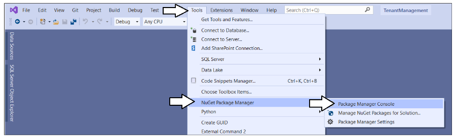

You should see the **Package Manager Console** where you can type and
execute PowerShell commands.

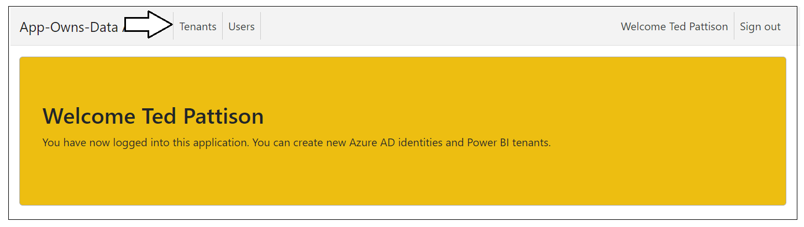

Next, you must configure the **AppOwnsDataAdmin** project as the
solution's startup project so the Entity Framework can retrieve the
database connection string from that project's **appsettings.json**
file. You can accomplish that by right-clicking the **AppOwnsDataAdmin**
project and selecting **Set as Start Project**.

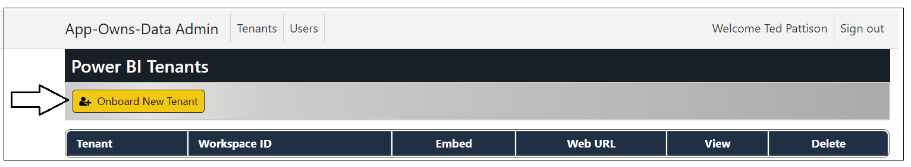

Inside the **Package Manager Console** window, set the **Default
project** to **AppOwnsDataShared**.

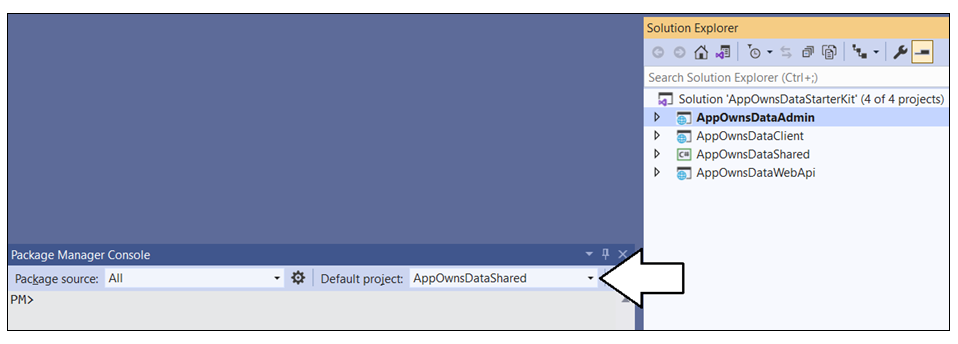

Type and execute the following **Add-Migration** command to create a new
migration in the project.

**Add-Migration InitialCreate**

The **Add-Migration** command should run without errors. If this command
fails you might have to modify the database connection string
in **appsettings.json**.

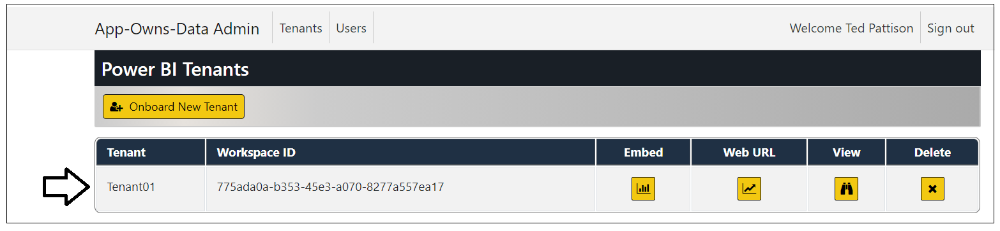

After running the **Add-Migration** command, you will see a new folder
has been automatically created in the **AppOwnsDataShared** project
named **Migrations** with several C# source files. There is no need to
change anything in these source files but you can inspect what's inside
them if you are curious how the Entity Framework Core does its work.

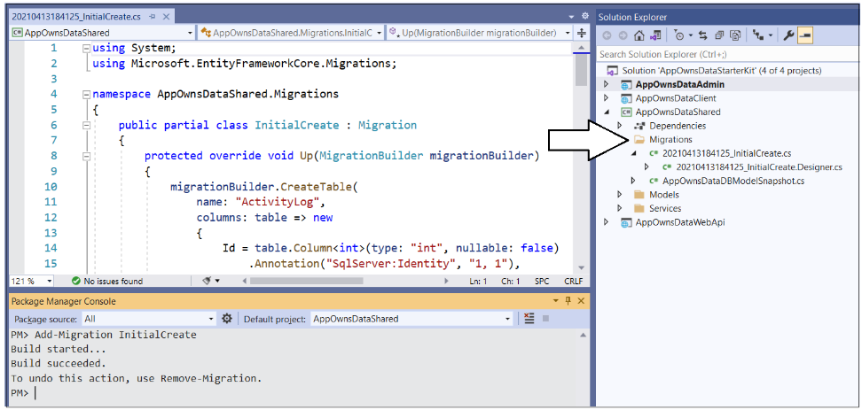

Return to the **Package Manager Console** and run the
following **Update-Database** command to generate the database
named **AppOwnsDataDB**.

**Update-Database**

The **Update-Database** command should run without errors and generate
the **AppOwnsDataDB** database.

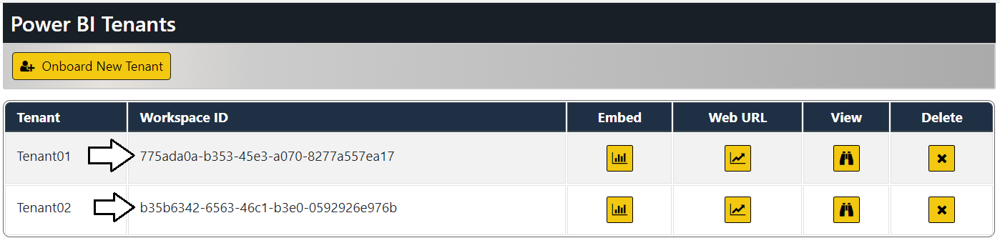

In Visual Studio, you can use the **SQL Server Object Explorer** to see
the database that has just been created. Open the **SQL Server Object
Explorer** by invoking the **View \>** **SQL Server Object
Explorer** menu command.

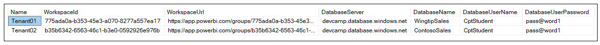

Expand the **Databases** node for the server you're using and verify you
see the **AppOwnsDataDB** database.

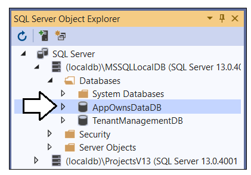

If you expand the **Tables** node, you should see the three tables
named **ActivityLog**, **Tenants** and **Users**.

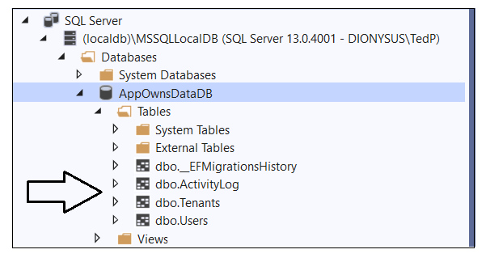

With **AppOwnsDataDB** set up, you're ready to run and test
**AppOwnsDataAdmin** in Visual Studio 2022.

## Test the AppOwnsDataAdmin Application

Launch the **AppOwnsDataAdmin** web application in the Visual Studio
debugger by pressing the **{F5}** key or by clicking the Visual
Studio **Play** button with the green arrow and the caption **IIS
Express**.

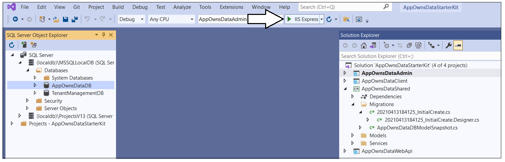

When the application starts, click the **Sign in** link in the upper
right corner to begin the user login sequence.

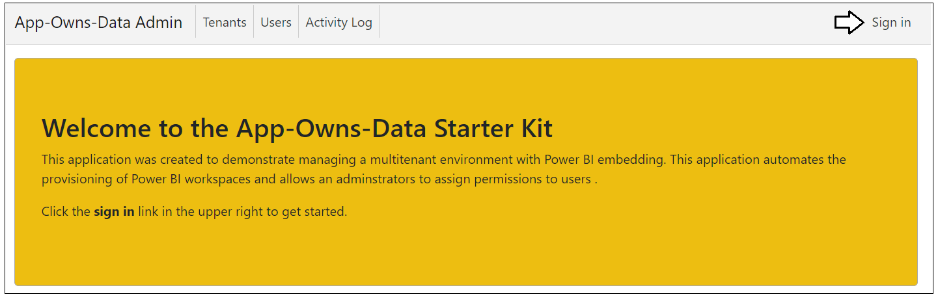

The first time you authenticate with Azure AD, you'll be prompted with
the **Permissions requested** dialog asking you to accept the
**Permissions requested** by the application. Click
the **Accept** button to grant these permissions and continue.

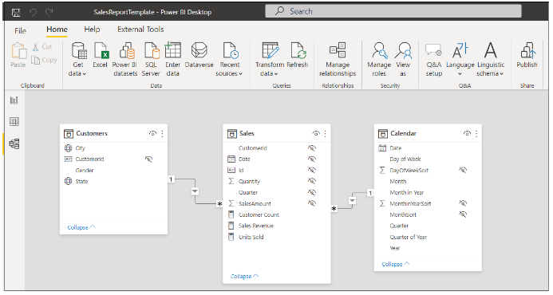

Once you have logged in, you should see your name in the welcome
message.

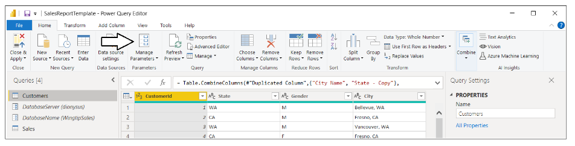

### Create new customer tenants

Start by creating a few new customer tenants. Click the **Tenants** link
to navigate to the **Tenants** page.

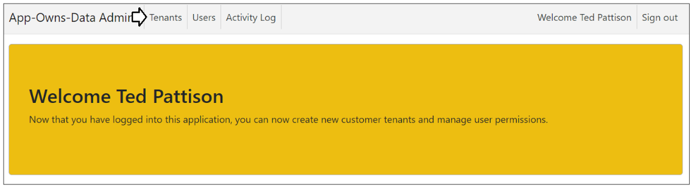

Click the **Onboard New Tenant** button to display the **Onboard New
Tenant** page.

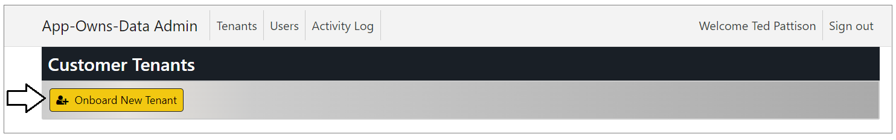

When you open the **Onboard New Tenant** page, it will automatically
populate the **Tenant Name** textbox with a value of **Tenant01**. Enter
a **Tenant Name** of **Wingtip Toys** and click the **Create New
Customer Tenant** button to begin the process of creating a new customer
tenant.

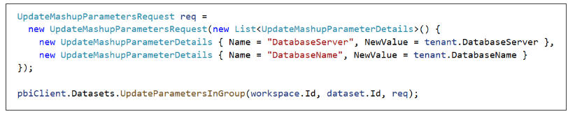

After a few seconds, you should see the new customer tenant has been
created.

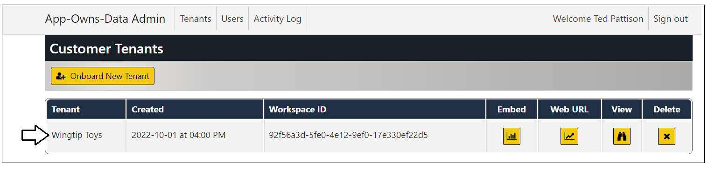

Click the **Onboard New Tenant** button again to create a second tenant.
This time, give the tenant a name of **Contoso**, select
**ContosoSales** for **Database Name** and then click **Create New
Tenant**.

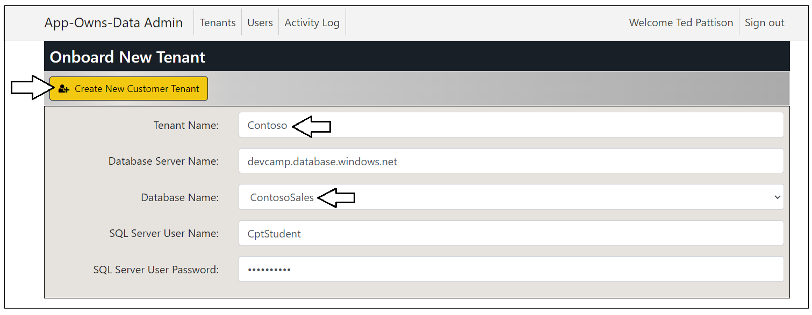

You should now have two customer tenants. Note they each tenant has its
own unique workspace ID.

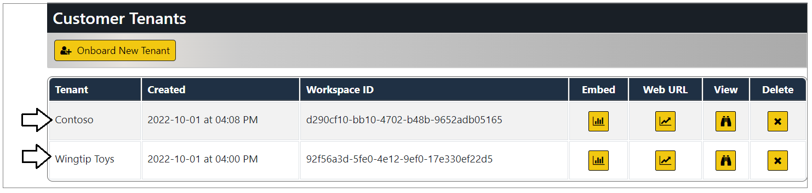

Now let's review what's going on behind the scenes whenever you create a
new customer tenant. The **AppOwnsDataAdmin** application uses the Power
BI REST API to implement the following onboarding logic.

- Create a new Power BI workspace

- Associate the workspace with a dedicated capacity (if TargetCapacityId
  is not an empty string)

- Import the template file named
  [**SalesReportTemplate.pbix**](https://github.com/PowerBiDevCamp/TenantManagement/raw/main/TenantManagement/wwwroot/PBIX/DatasetTemplate.pbix) to
  create the **Sales** dataset and the **Sales** report

- Update dataset parameters on **Sales** dataset to point to the
  customer's SQL Server database instance

- Patch credentials for the SQL Server datasource used by
  the **Sales** dataset

- Start a refresh operation on the **Sales** database to import data
  from the customer's database

- Import the template file named **SalesSummaryPaginated.rdl** to create
  paginated report named **Sale Summary** which is dynamically bound to
  the **Sales** dataset

If you want to inspect the C# code in **AppOwnsDataAdmin** that that
implements this logic using the Power BI .NET SDK, you can examine the
**OnboardNewTenant** method in the source file named
[**PowerBiServiceApi.cs**](https://github.com/PowerBiDevCamp/App-Owns-Data-Starter-Kit/blob/main/AppOwnsDataAdmin/Services/PowerBiServiceApi.cs).

The **AppOwnsDataAdmin** application also creates a new record in
the **Tenants** table of the **AppOwnsDataDB** database to track the
relevant data associated with each customer tenant.

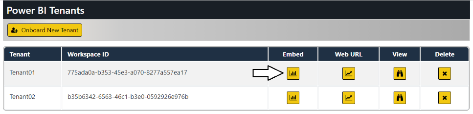

Click on the **View** button for a tenant on the **Power BI
Tenants** page to drill into the **Tenant Details** page.

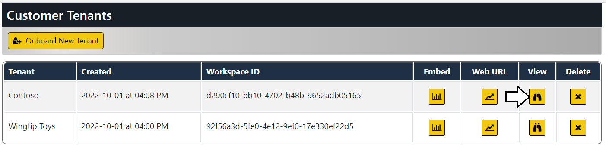

The **Tenant Details** page displays Power BI workspace details
including its members, datasets and reports.

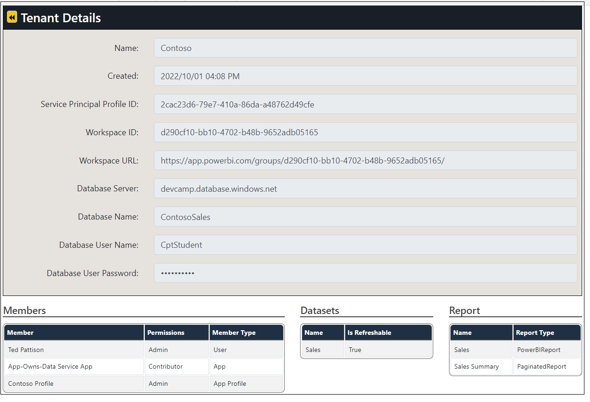

Click on the back arrow to return to the **Customer Tenants** page.

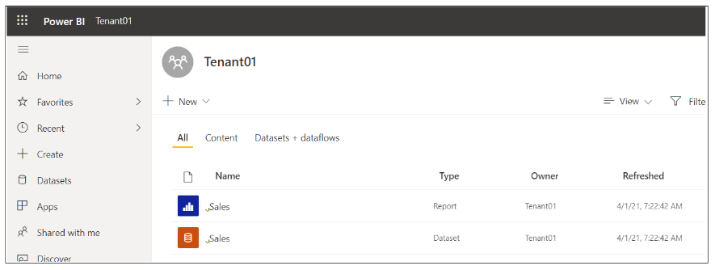

### Understanding the PBIX template file named SalesReportTemplate.pbix

The **App-Owns-Data Starter Kit** solution uses a PBIX template file
named **SalesReportTemplate.pbix** to execute an import operation which
creates the **Sales** dataset and the **Sales** report. This template
file is included as part of the **AppOwnsDataAdmin** project inside the
**wwwroot** folder at a path of **/PBIX/SalesReportTemplate.pbix**.

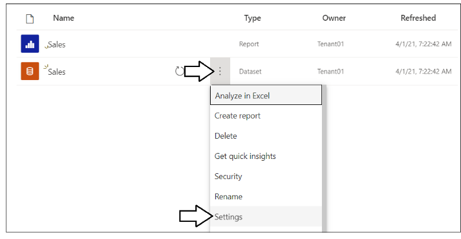

If you're interested in how this template file has been created, you can
open it in Power BI Desktop. You will see there are seven tables in the
data model for the **SalesReportTemplate.pbix** project. Theses tables
are populated by importing and refreshing data from Azure SQL Server
databases that share a common table schema.

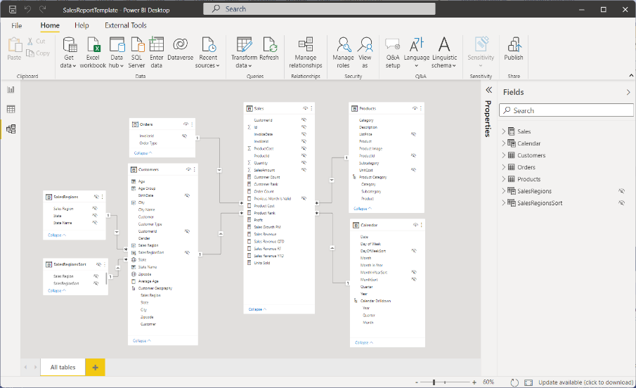

It's important to understand how this PBIX template allows the developer
to update the database server and database name after the import
operation has created the **Sales** dataset in the Power BI Service.
Click **Transform Data** to open the **Power Query Editor** window and
then click the **Manage Parameters** button.

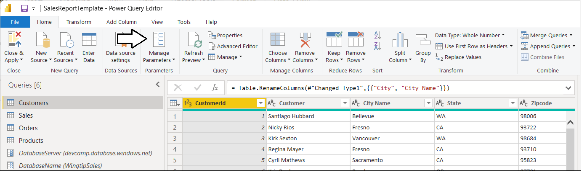

In the **Manage Parameters** window, you should two **Text** parameters
named **DatabaseServer** and **DatabaseName**.

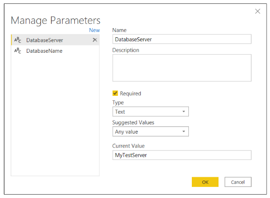

Click **Cancel** to close the **Manage Parameters** window and return to
the **Power Query Editor** window.

Select the **Customers** query in the **Queries** list and click
**Advanced Editor** to inspect the M code in the **Advanced Editor**
window. You should see that the call to **Sql.Database** uses the
parameters values instead of hard-coded values.

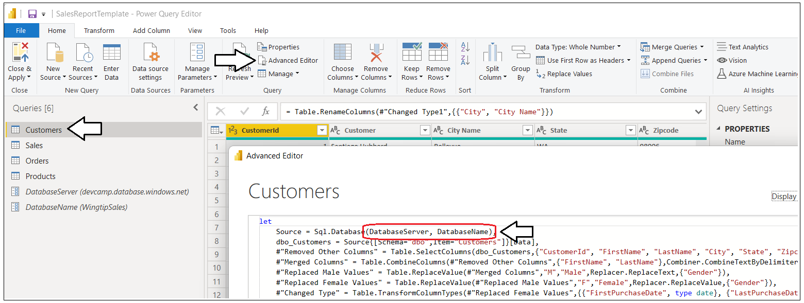

If you inspect the **OnboardNewTenant** method in the source file named
[**PowerBiServiceApi.cs**](https://github.com/PowerBiDevCamp/App-Owns-Data-Starter-Kit/blob/main/AppOwnsDataAdmin/Services/PowerBiServiceApi.cs),
you will find this code which updates these two parameters using the
support in the Power BI .NET SDK.

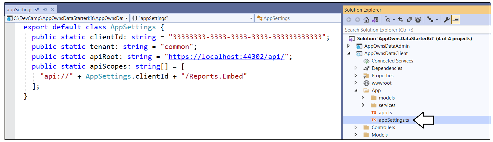

Close the Power Query Editor window and return to the main Power BI
Desktop window. Have a look at the report and tale a minute to move
through all the pages and see what they display.

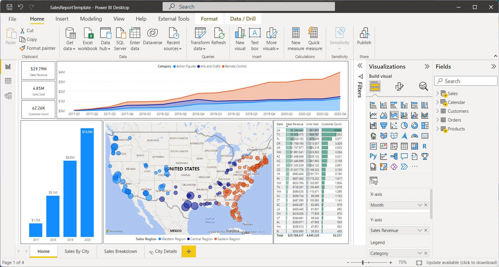

After you have had a look at each page, move back to the page named
**Home**. Now navigate to the **View** tab in the ribbon and click the
**Mobile layout** button to see the report's mobile view.

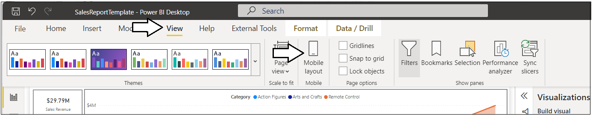

You should see that this report has been designed with a mobile view in
addition to the standard master view.

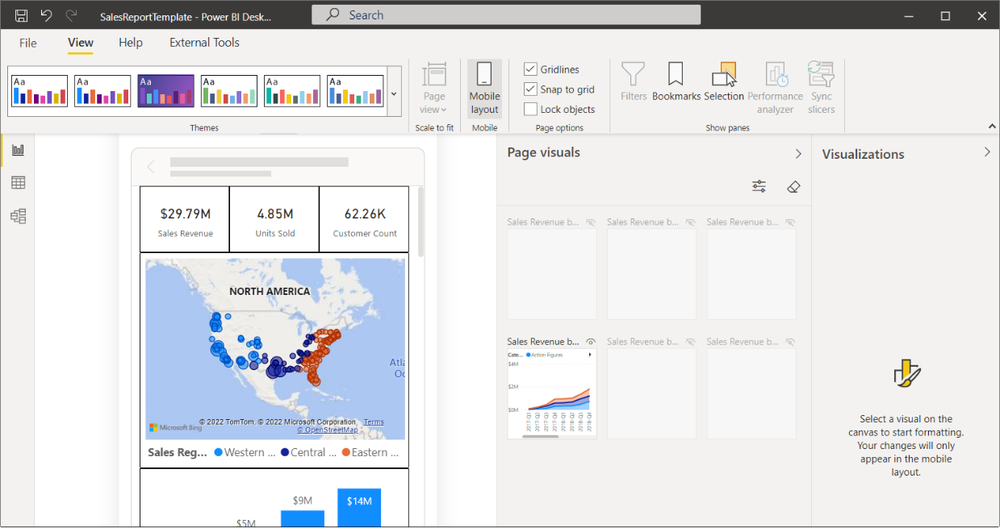

You can now close Power BI Desktop and move back to the
**AppOwnsDataAdmin** application.

### Embed reports

Now it's time to make use of the **AppOwnsDataAdmin** application's
ability to embed reports. Click the **Embed** button for a customer
tenant to navigate to the **Embed** page and view the **Sales** report.

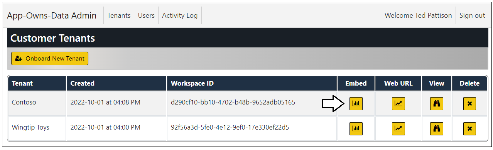

You should now see a page with an embedded report for that tenant. Click
on the yellow back arrow button in the upper left corner to return to
the **Customer** **Tenants** page.

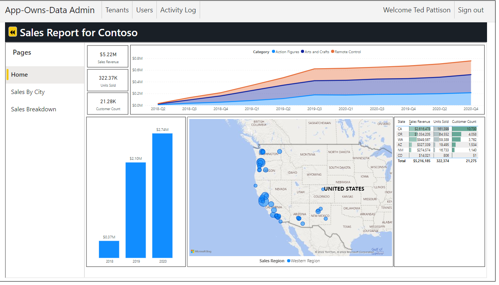

Now test clicking the **Embed** button for other customer tenants. The
**AppOwnsDataAdmin** application has the ability to embed the **Sales**
report from any of the customer tenants that have been created.

### Inspect the Power BI workspaces being created

If you're curious about what's been created in Power BI, you can see for
yourself by navigating to the Power BI Service portal
at [**https://app.powerbi.com**](https://app.powerbi.com/). You should
be able to see and navigate to any of the Power BI workspaces that have
been created by the **AppOwnsDataAdmin** application by clicking on the
Web URL button on the **Customer Tenants** page.

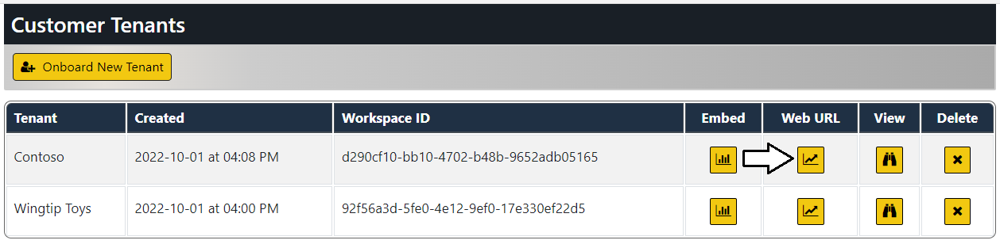

Click on the Web URL button for the customer tenant named **Contoso** so
you can navigate to the workspace in the browser experience provided by
the Power BI Service.

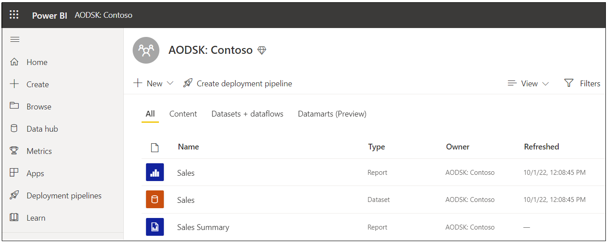

Drill into the **Setting** page for the dataset named **Sales**.

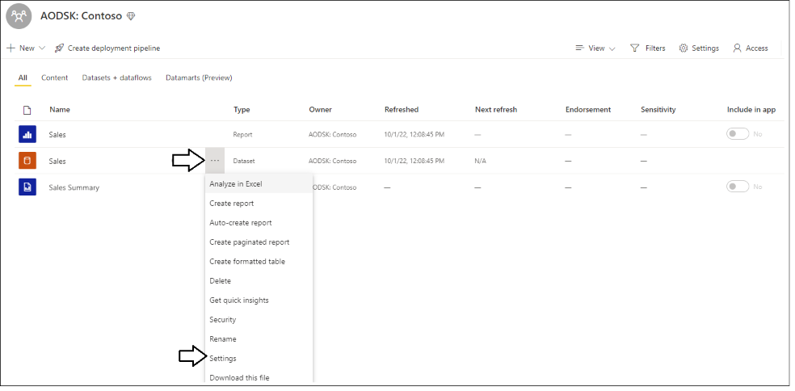

You should be able to verify that the **Sales** dataset has been
configured by the **App-Owns-Data Service App**. You should also be able
to see the **Last refresh succeeded** message for the dataset refresh
operation that was started by the **AppOwnsDataAdmin** as part of its
tenant onboarding logic.

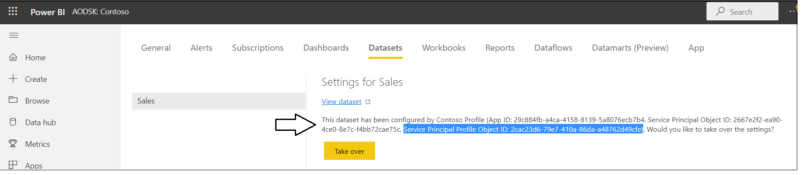

## Configure the application configure the AppOwnsDataWebApi project

In order to test the **AppOwnsDataClient** application, you must first
configure the **AppOwnsDataWebApi** project. Once you configure the
**AppOwnsDataWebApi** project, you will then configure and test the
**AppOwnsDataClient** application.

### Update the appsettings.json file for AppOwnsDataWebApi

Before you can run the **AppOwnsDataWebApi** project in the Visual
Studio debugger, you must update several important application settings
in the **appsettings.json** file. Open the **appsettings.json** file
inside the **AppOwnsDataWebApi** project and examine the JSON content
inside. There are four important sections
named **ClientApp**, **ServicePrincipalApp**, **PowerBi** and
**AppOwnsDataDB**.

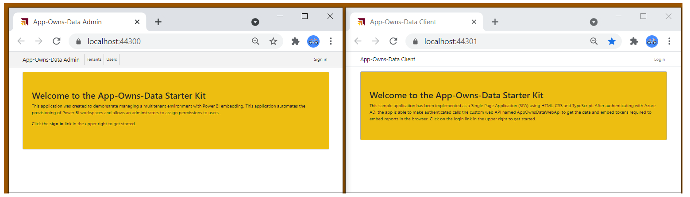

Inside the **ClientApp** section, update the update the
**ClientId** with the data you collected when creating the Azure AD
application named **App-Owns-Data Client App.**

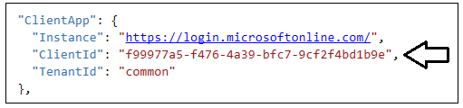

Inside the **ServicePrincipalApp** section, update
the **TenantId**, **ClientId** and **ClientSecret** with the data you
collected when creating the Azure AD application named **App-Owns-Data
Service App.**

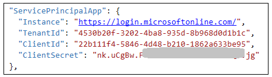

There is no need to update the **PowerBi** section as long as your are
using Power BI in the public cloud. If you are using Power BI in one of
the government clouds or in sovereign clouds for Germany or China, this
URL must be updated appropriately. See [this
page](https://docs.microsoft.com/en-us/power-bi/admin/service-govus-overview)
for details.

Inside the **AppOwnsDataDB** section, ensure that the database
connection string used here is the same as the database connection
string used in the **appsettings.json** file in the **AppOwnsDataAdmin**
application. Obviously, it's important for both these applications to
read and write from the same database instance.

Save your changes and close the **appsettings.json** file in the
**AppOwnsDataWebApi** project. Now that the **AppOwnsDataWebApi**
project has been configured, you can move ahead to configure and test
either the **AppOwnsDataClient** application or the
**AppOwnsDataReactClient** application.

## Test the AppOwnsDataClient application

In the **AppOwnsDataClient** project, expand the **App** folder and open
the **appSettings.ts** file

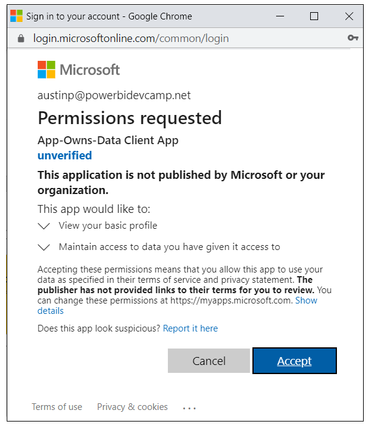

Update the **ClientId** with the Client ID of the Azure AD application
named **App-Owns-Data Client App.**

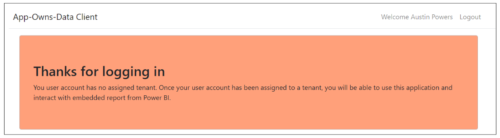

Save your changes and close **appSettings.ts**.

Now, it's time to build the **AppOwnsDataClient** project. Note that the
build process for the **AppOwnsDataClient** project is configured to use
Node.js to compile the TypeScript code in the project into a single
JavaScript file for distribution named **bundle.js**. Before building
the project, double-click on the **AppOwnsDataClient** node in the
solution explorer to open the project file named
**AppOwnsDataClient.csproj**.

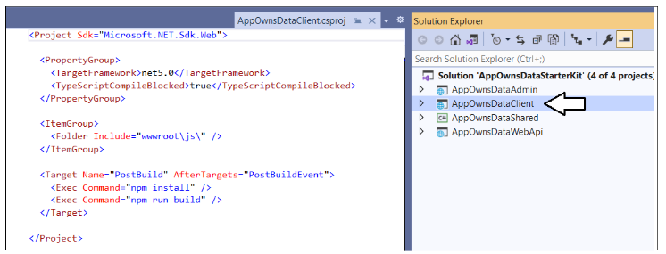

There is an XML element in **AppOwnsDataClient.csproj** which defines a
post build event that calls the Node.js commands **npm install** and
**npm run build**. For this reason, you must install Node.js before you
can build the project.

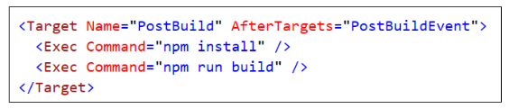

If you haven't installed node.js, install it now [from
here](https://nodejs.org/en/download/). Once Node.js has been installed,
right-click the **AppOwnsDataClient** solution in the Solution Explorer
and select the **Rebuild** command

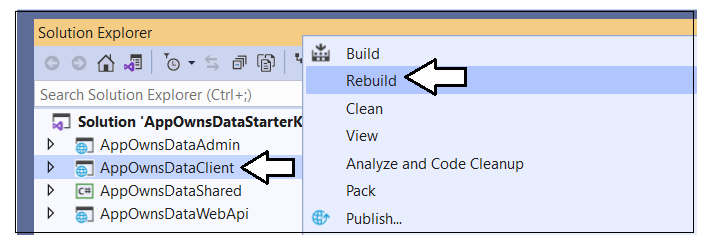

When Visual Studio runs the build process, you should be able to watch
the **Output** window and see output messages indicating that the **npm
install** command has run and that the **npm run build** command has
triggered the **webpack** utility to compile all the Typescript code in
the project into a single JavaScript file for distribution named
**bundle.js**.

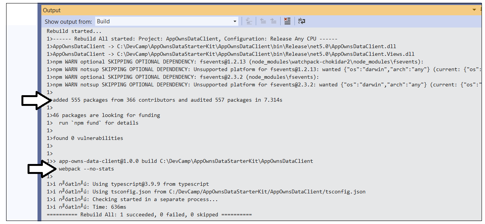

The build process should generate a new copy of **bundle.js** in the
project at a path of **wwwroot/js**.

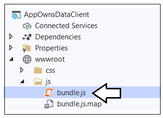

### Launch AppOwnsDataClient in the Visual Studio debugger

Now, it's finally time to test the **AppOwnsDataClient** application.
However, you must first configure the Visual Studio solution to launch
both the **AppOwnsDataAdmin** application and the **AppOwnsDataClient**
application at the same time so you can properly test the application's
functionality. Right-click on the **AppOwnsDataStarterKit** solution
node in the Solution Explorer and select the **Properties** command.

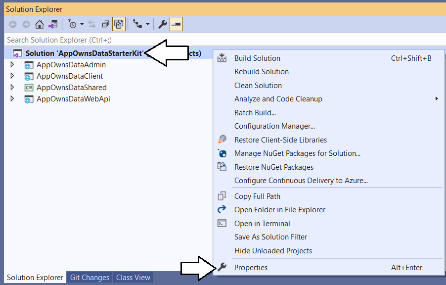

On the **Setup Project** page, select the option for **Multiple startup
projects** and configure an **Action** of **Start** for
**AppOwnsDataWebApi**, **AppOwnsDataAdmin** and **AppOwnsDataClient** as
shown in the following screenshot.

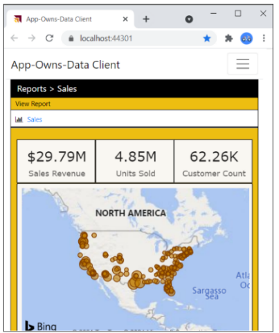

Launch the solution in the Visual Studio debugger by pressing
the **{F5}** key or by clicking the Visual Studio **Play** button with
the green arrow.

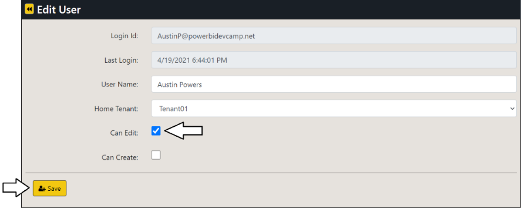

When the solution starts in the Visual Studio debugger, you should see
one browser session for **AppOwnsDataAdmin** at
<https://localhost:44300> and a second browser session for
**AppOwnsDataClient** at <https://localhost:44301>.

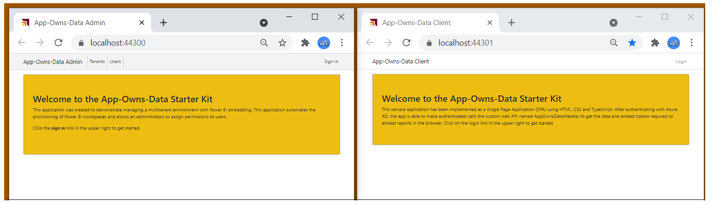

Sign into the **AppOwnsDataClient** application by clicking the
**Login** link.

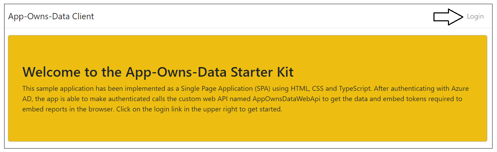

Sign into the **AppOwnsDataClient** application using any Microsoft
organization account or Microsoft personal account.

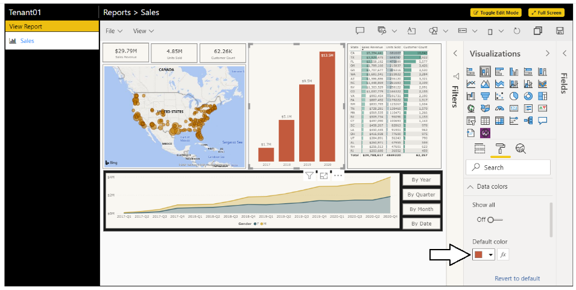

After authenticating with your user name and password, you'll be
prompted with the **Permissions requested** dialog. Click the **Accept**
button to continue.

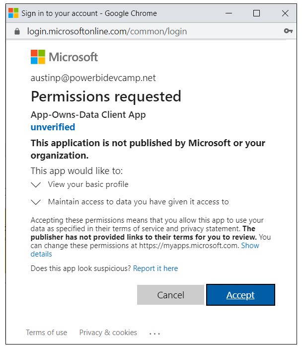

After logging in you should see a web page like the one in the following
screenshot indicating that the current user has not been assigned to a
customer tenant.

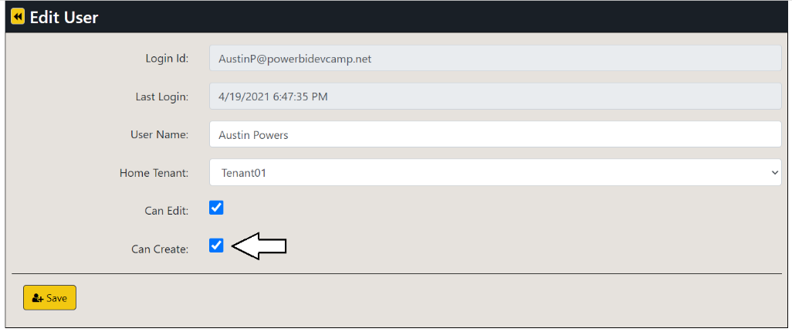

At this point, you have logged in with a user account that has not yet
been assigned to a customer tenant. Consequently, you cannot see any
content. Over the next few steps, you will switch move back and forth
between the **AppOwnsDataAdmin** application and the
**AppOwnsDataClient** application to configure and test user
permissions.

### Assign user permissions

Move over to the browser session running the **AppOwnsDataAdmin**
application and navigate to the **Users** page. You should see that the
user account you used to log into **AppOwnsDataClient** is currently
**unassigned**.

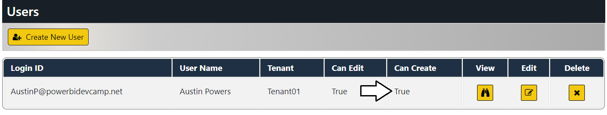

Click the **Edit** button to open the **Edit User** page for this user
account.

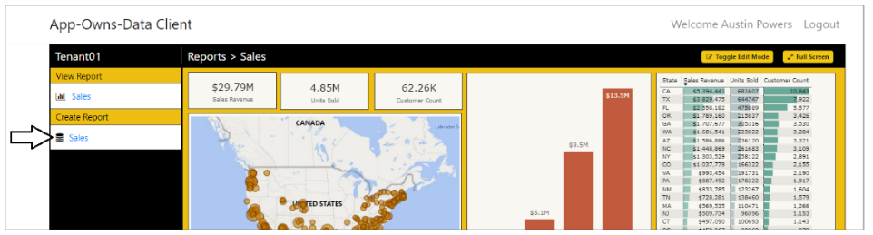

On the **Edit User** page, drop down the **Home Tenant** options menu
and select an available tenant.

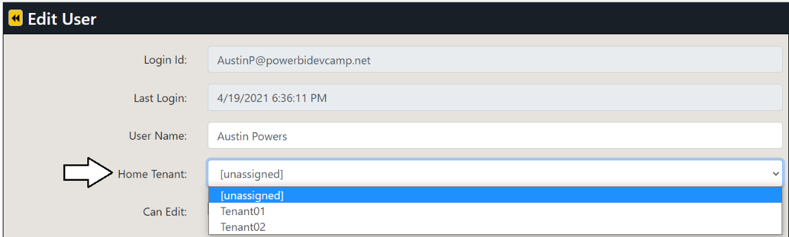

Once you have selected a tenant such as **Tenant01**, click the **Save**
button to save your changes.

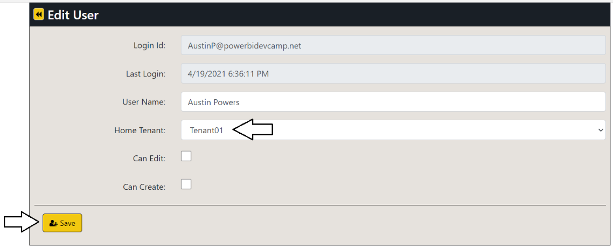

You should be able to verify that this user account has been assigned to
an existing tenant.

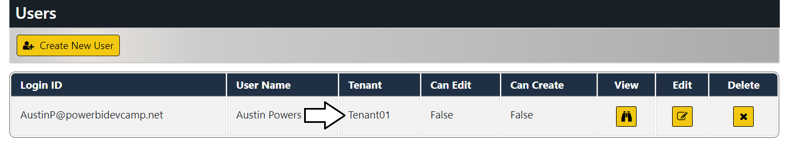

Return to the browser session running the **AppOwnsDataClient**
application and refresh the page. When the page refreshes, you should
see the **Sales** report has been successfully embedded in the browser

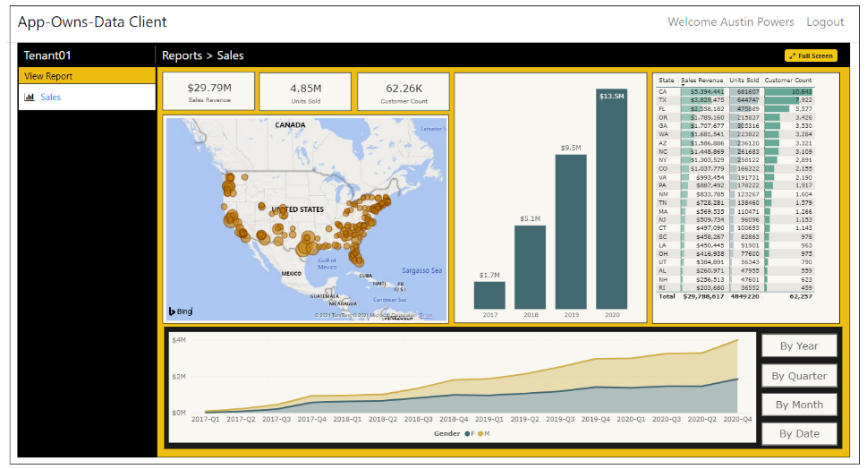

Adjust the size of the browser window to make it more narrow. Once the
browser window width is small enough, the report should begin to render
using the mobile view.

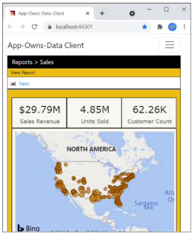

### Create and edit reports using the AppOwnsDataClient application

You've now seen how to configure read-only permissions for users. Next,
you will configure your user account with edit permissions so that you
can customize a report using the **AppOwnsDataClient** application.
Return to the browser session running the **AppOwnsDataAdmin**
application and navigate to the **Users** page. Click the **Edit**
button to open the **Edit User** page for your user account. Check the
**Can Edit** checkbox and click **Save**.

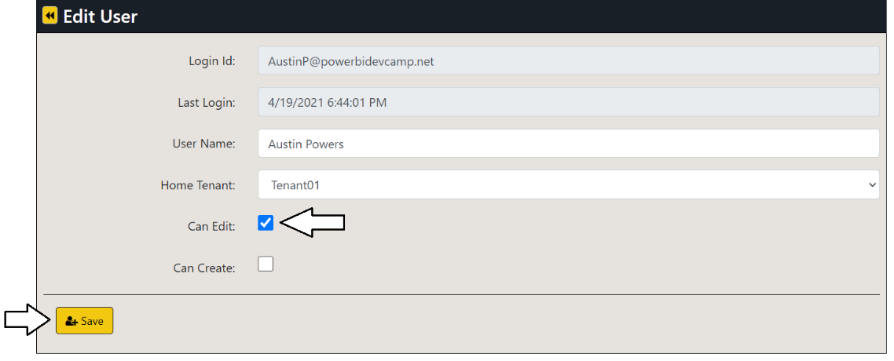

You should be able to verify that **Can Edit** property for your user
account has been set to **True**.

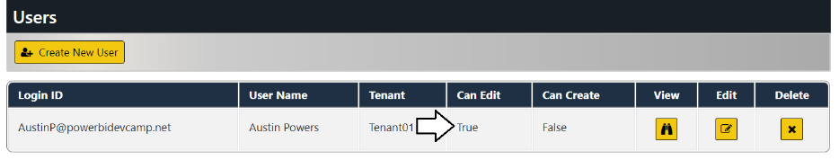

Return to the browser session running the **AppOwnsDataClient**
application and refresh the page. When the application initializes, it
should automatically embed the **Sales** report and display the **Toggle
Edit Mode** button. Move the report into edit mode by clicking the
**Toggle Edit Mode** button.

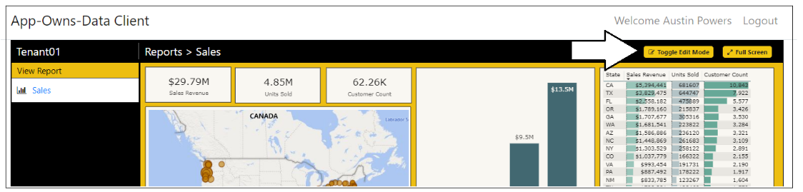

Make a simple customization to the report such as changing the **Default
color** for the bar chart.

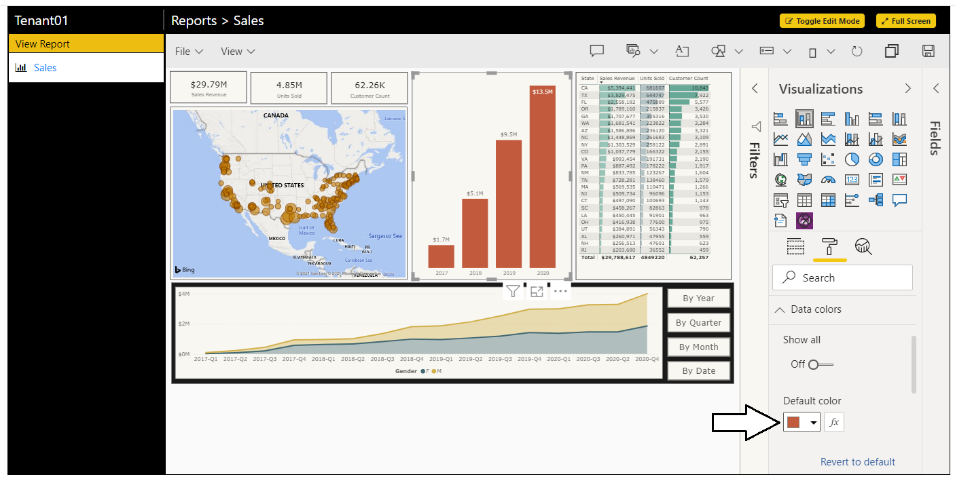

Save your changes by invoking the **File \> Save** menu command.

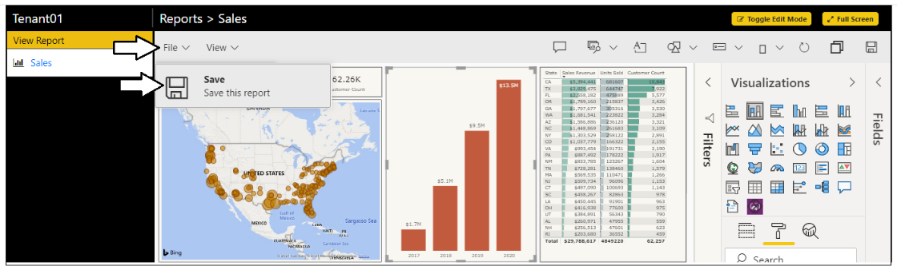

You've now seen how to configure edit permissions for users and you've
tested the authoring experience for customizing a report in the browser.
Next, you will give you user account create permissions so that a user
can create a new report or invoke a **SaveAs** command on an existing
report to create a new report which is a copy.

Return to the browser session running the **AppOwnsDataAdmin**
application and navigate to the **Users** page. Click the **Edit**
button to open the **Edit User** page for your user account. Check the
**Can Create** checkbox and click **Save**.

You should be able to verify that the **Can Create** property for your
user account has been set to **True**.

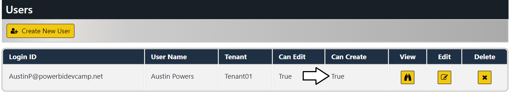

Return to the browser session running the **AppOwnsDataClient**
application and refresh the page. Now when the application initializes,
it should display a **Create Report** section in the left navigation.
Click on the **Sales** dataset link in the **Create Report** section in
the left navigation to create a new report.

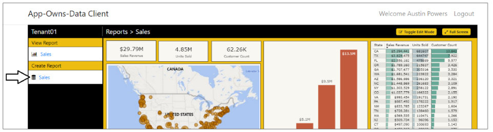

You should now see the Power BI report designer with a new report built
on the **Sales** dataset. Click the **Full Screen** button to move to
full-screen mode where it will be easier to build a new report**.**

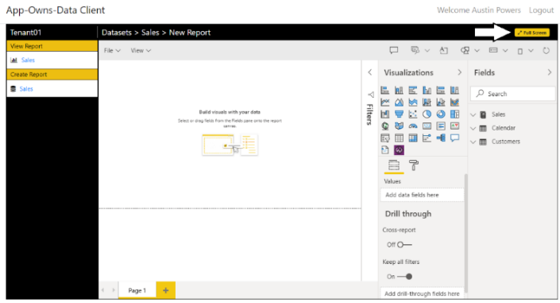

When in full-screen mode, create a simple report layout using whatever
visuals you'd like.

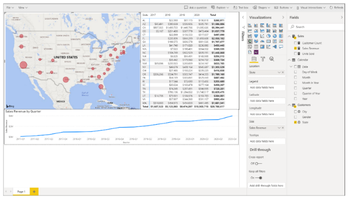

Once you have created a simple report, press the **Esc** key to get out
of full screen mode. Now click the **File \> Save As** menu command to
save the report back to the customer tenant workspace.

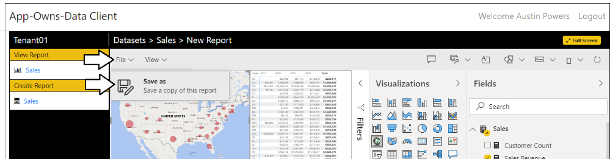

In the **Save your repot** dialog, enter a name such as **Sales by Year
and Quarter** and click the **Save** button.

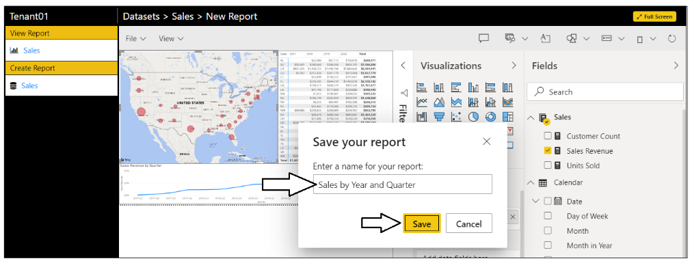

After saving the report, you should see in the left navigation and the
application breadcrumb are updated appropriately.

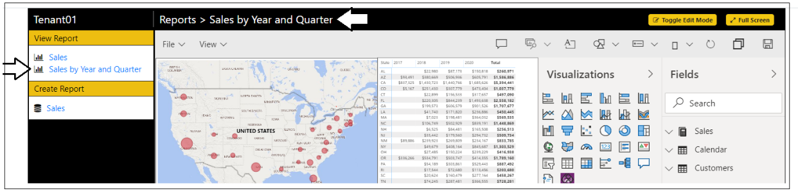

You have now seen how to configure user permissions for viewing, editing
and creating content.

## Test the AppOwnsDataReactClient application

In the **AppOwnsDataReactClient** project, expand the **App** folder and
open the **AuthConfig.ts** file

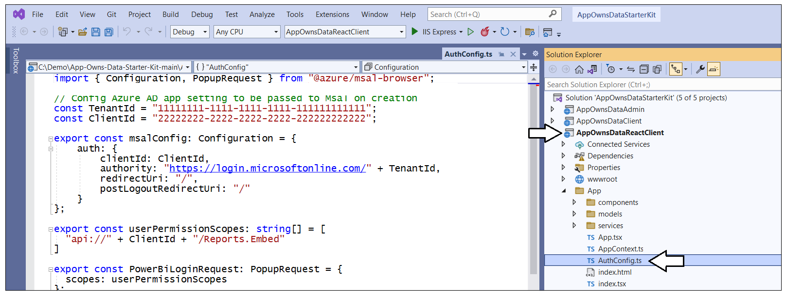

Update the **TenantId** and **ClientId** with the Tenant ID and the
Client ID of the Azure AD application named **App-Owns-Data Client
App.**

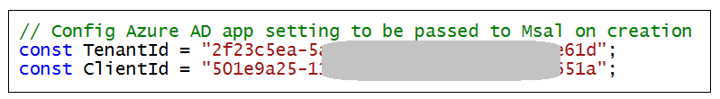

Save your changes and close A**uthConfig.ts**.

Now, it's time to build the **AppOwnsDataReactClient** project. Note
that the build process for the **AppOwnsDataReactClient** project is
configured to use Node.js to compile the TypeScript code in the project
into a single JavaScript file for distribution named **bundle.js**.
Before building the project, double-click on the
**AppOwnsDataReactClient** node in the solution explorer to open the
project file named **AppOwnsDataClient.csproj**.

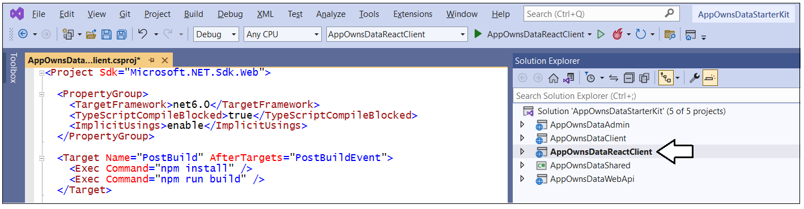

There is an XML element in **AppOwnsDataReactClient.csproj** which
defines a post build event that calls the Node.js commands **npm
install** and **npm run build**. For this reason, you must install
Node.js before you can build the project.

If you haven't installed node.js, install it now [from
here](https://nodejs.org/en/download/). Once Node.js has been installed,
right-click the **AppOwnsDataReactClient** solution in the Solution
Explorer and select the **Rebuild** command

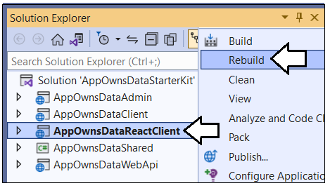

When Visual Studio runs the build process, you should be able to watch
the **Output** window and see output messages indicating that the **npm
install** command has run and that the **npm run build** command has
triggered the **webpack** utility to compile all the Typescript code in
the project into a single JavaScript file for distribution named
**bundle.js**.

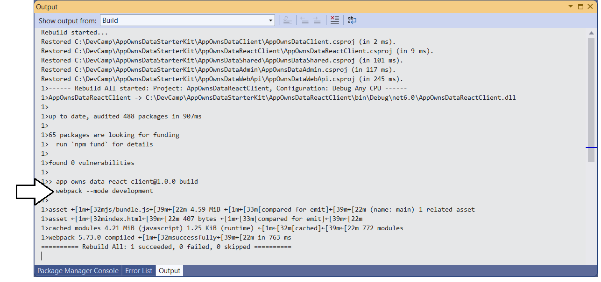

The build process should generate a new copy of **bundle.js** in the
project at a path of **wwwroot/js**.

### Launch AppOwnsDataReactClient in the Visual Studio debugger

Now, it's time to test the **AppOwnsDataReactClient** application.
However, you must first configure the Visual Studio solution to launch
both the **AppOwnsDataAdmin** application and the
**AppOwnsDataReactClient** application at the same time so you can
properly test the application's functionality. Right-click on the
**AppOwnsDataStarterKit** solution node in the Solution Explorer and
select the **Properties** command.

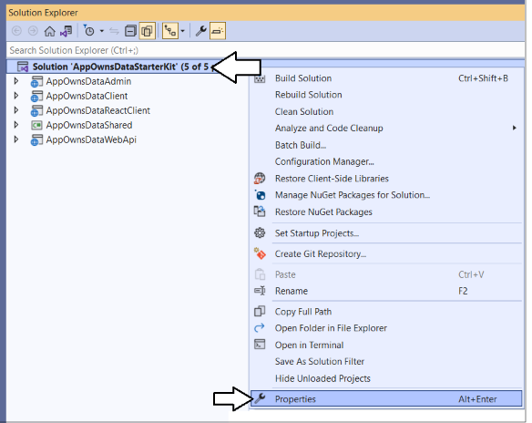

On the **Setup Project** page, select the option for **Multiple startup
projects** and configure an **Action** of **Start** for
**AppOwnsDataWebApi**, **AppOwnsDataAdmin** and
**AppOwnsDataReactClient** as shown in the following screenshot.

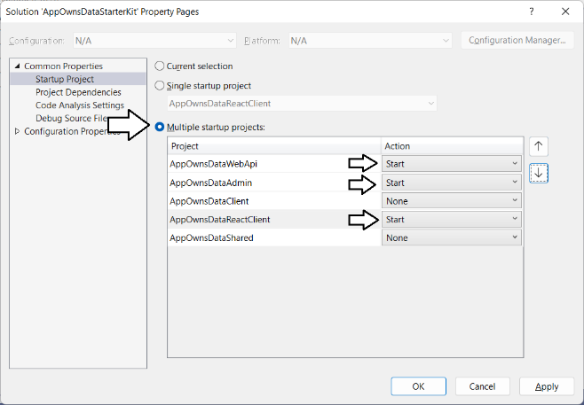

Launch the solution in the Visual Studio debugger by pressing
the **{F5}** key or by clicking the Visual Studio **Play** button with
the green arrow.

When the solution starts in the Visual Studio debugger, you should see
one browser session for **AppOwnsDataAdmin** at
<https://localhost:44300> and a second browser session for
**AppOwnsDataReactClient** at <https://localhost:44303>.

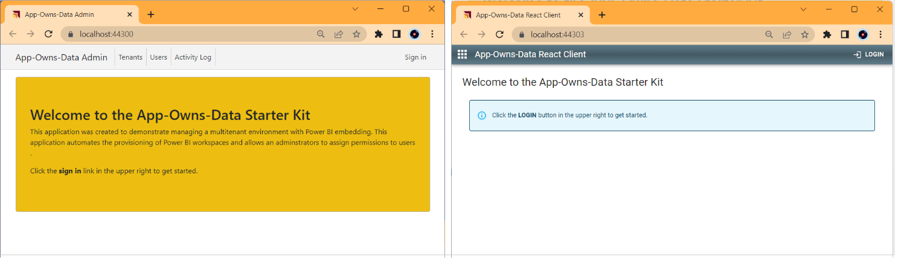

This walk through of the user experience with **AppOwnsDataReactClient**
assumes that the user account you are using has not yet been assigned to
a customer tenant. If you have already configured your user account with
a customer tenant when testing the **AppOwnsDataClient** application,
then you should use the **AppOwnsDataAdmin** application to return your
user account into a state where it is unassigned as shown in the
following screenshot.

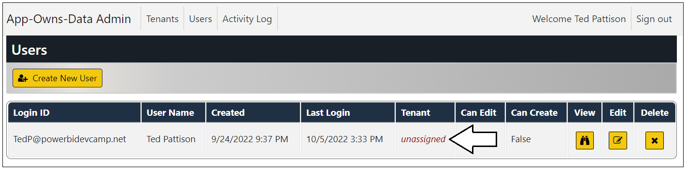

Now, move over the browser windows with the **AppOwnsDataReactClient**
application and click the **Login** link to sign in.

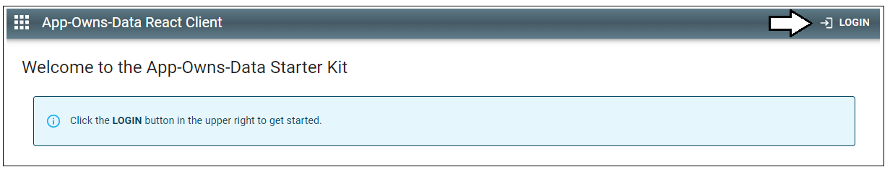

Sign into the **AppOwnsDataReactClient** application using the user
account you are using for testing.

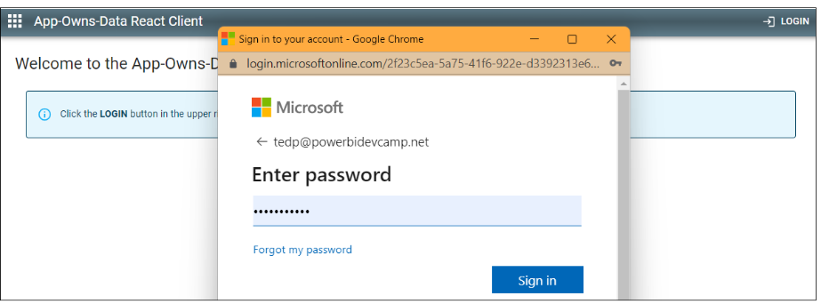

If you are authenticating for the first time, you will be prompted with
the **Permissions requested** dialog. If you are prompted with this
dailog, click the **Accept** button to continue.

After logging in, you should see the home page of
**AppOwnsDataReactClient** as shown in the following screenshot with a
message indicating that the current user has not been assigned to a
customer tenant.

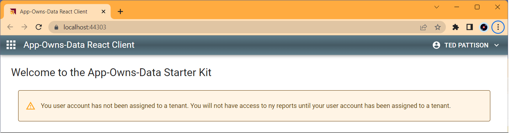

At this point, you have logged in with a user account that has not yet
been assigned to a customer tenant. Consequently, you cannot see any
content. Over the next few steps, you will switch move back and forth
between the **AppOwnsDataAdmin** application and the
**AppOwnsDataReactClient** application to configure and test user
permissions.

### Assign user permissions

Move over to the browser session running the **AppOwnsDataAdmin**
application and navigate to the **Users** page. You should see that the
user account you used to log into **AppOwnsDataReactClient** is
currently **unassigned**. Click the **Edit** button to open the **Edit
User** page for this user account.

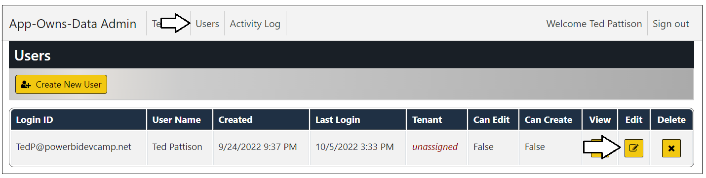

On the **Edit User** page, drop down the **Home Tenant** options menu
and select an available tenant. Once you have selected a tenant such as
**Wingtip Toys**, click the **Save** button to save your changes.

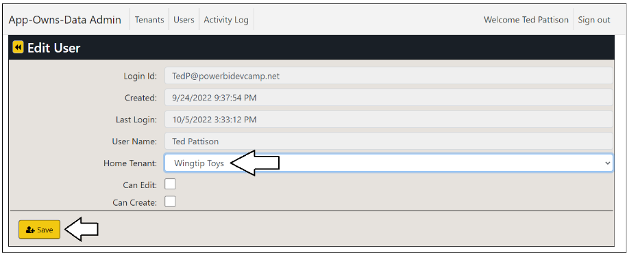

You should be able to verify that this user account has been assigned to
an existing tenant.

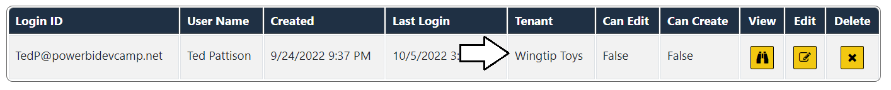

Return to the browser session running **AppOwnsDataReactClient** and
refresh the page. Once the page refreshes, you should see the home page
now shows a left navigation menu with available reports and details of
the user session.

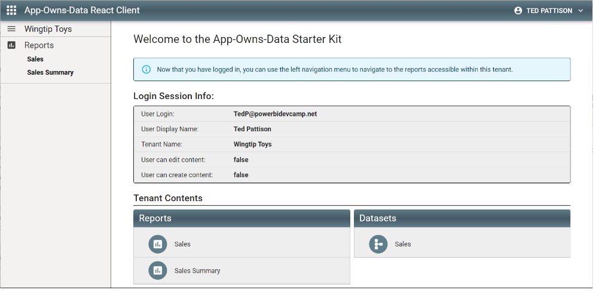

Click on the **Sales** link in the left navigation to embed the
**Sales** report. You should see that the report is successfully
embedded and displayed to the user. You should notice that the end of
the URL contains the **Sales** report ID.

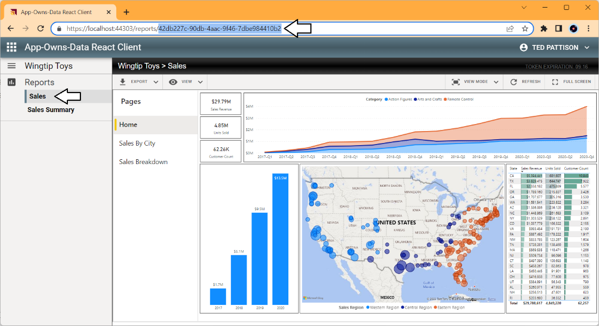

Click on the **Sales Summary** link in the left navigation to embed the
**Sales Summary** report. Note that this is a paginated report as
opposed to a standard Power BI report.

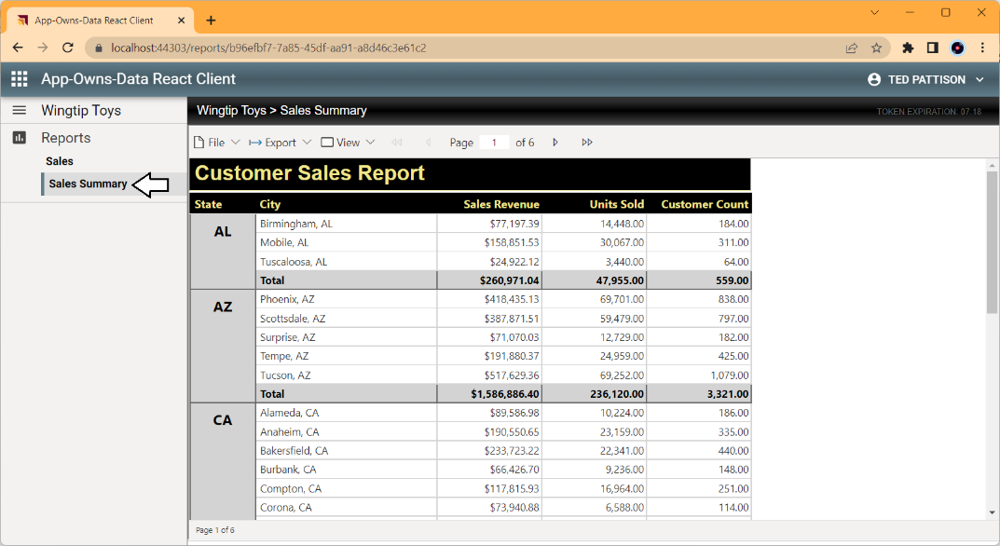

### Create and edit reports using the AppOwnsDataClient application

You've now seen how to configure read-only permissions for users. Next,
you will configure your user account with edit permissions so that you
can customize a report using the **AppOwnsDataReactClient** application.
Return to the browser session running the **AppOwnsDataAdmin**
application and navigate to the **Users** page. Click the **Edit**
button to open the **Edit User** page for your user account. Check the
**Can Edit** checkbox and click **Save**.

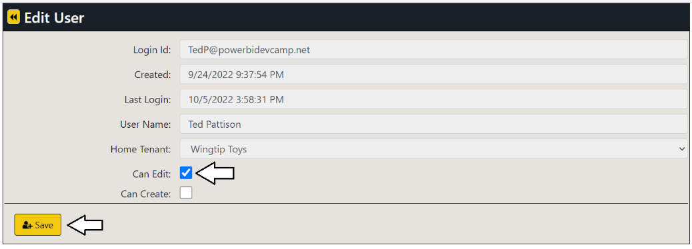

You should be able to verify that **Can Edit** property for your user
account has been set to **True**.

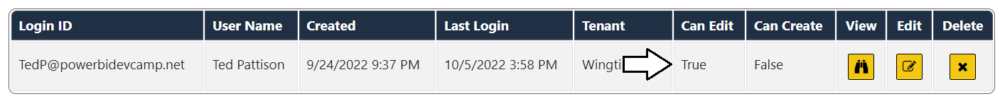

Return to the browser session running the **AppOwnsDataReactClient**
application and refresh the page. After the page has refreshed, navigate
back to the **Sales** report. Once you have embedded the **Sales**
report, **AppOwnsDataReactClient** should display an **Edit** button on
the toolbar above the report. Click the **Edit** button to move the
report into edit mode.

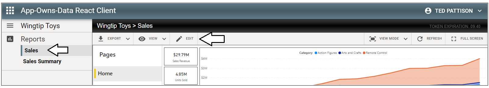

Once you move the report into edit mode, you should be able to edit the
report using the same report designer experience made available by the
Power BI Service. Make a simple customization to the report such as
changing the **Default color** for the column chart.

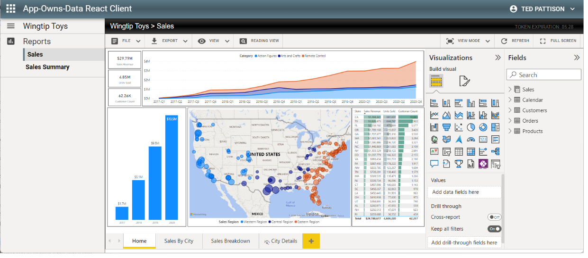

Save your changes by invoking the **File \> Save** menu command.

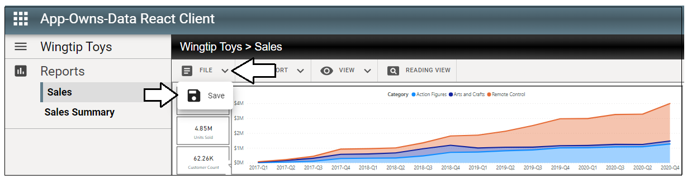

You've now seen how to configure edit permissions for users and you've
tested the authoring experience for customizing a report in the browser.
Next, you will give you user account create permissions so that a user
can create a new report or invoke a **SaveAs** command on an existing
report to create a new report which is a copy.

Return to the browser session running the **AppOwnsDataAdmin**
application and navigate to the **Users** page. Click the **Edit**
button to open the **Edit User** page for your user account. Check the
**Can Create** checkbox and click **Save**. You should be able to verify
that the **Can Create** property for your user account has been set to
**True**.

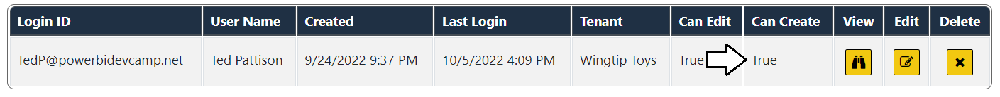

Return to the browser session running the **AppOwnsDataReactClient**
application and refresh the page. Now when the application initializes,
it should display a **Datasets** section in the left navigation.

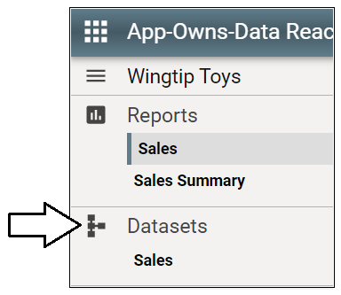

Click on the **Sales** link in the **Datasets** section in the left
navigation to create a new report based. You should now see the Power BI
report designer with a new report with the tables for the **Sales**
dataset shown in the **Fields** list on the right.

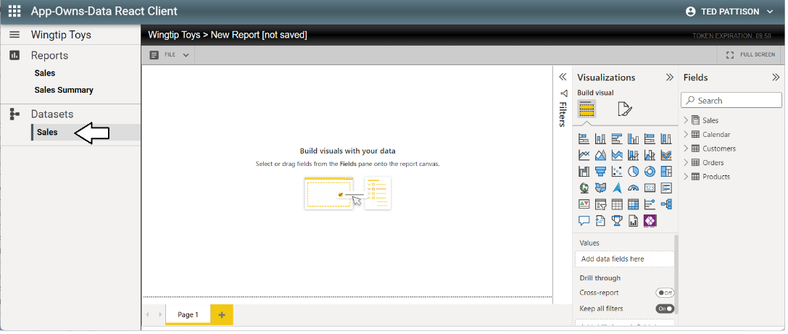

Click the **Full Screen** button to move to full-screen mode where it
will be easier to build a new report**.**

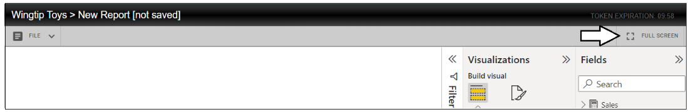

When in full-screen mode, create a simple report layout using whatever
visuals you'd like.

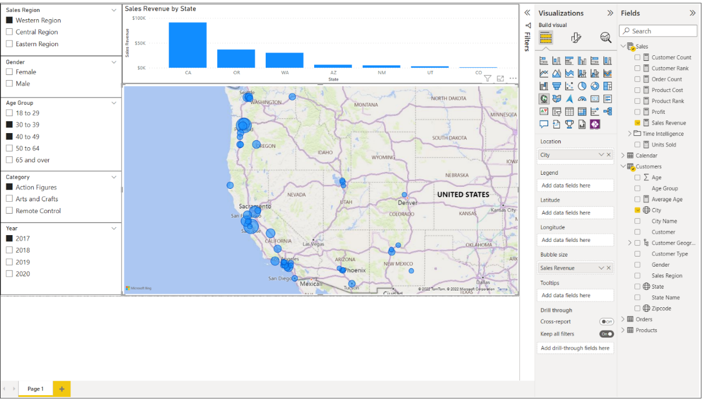

Once you have created a simple report, press the **Esc** key to get out
of full screen mode. Now click the **File \> Save As** menu command to
save the report back to the customer tenant workspace.

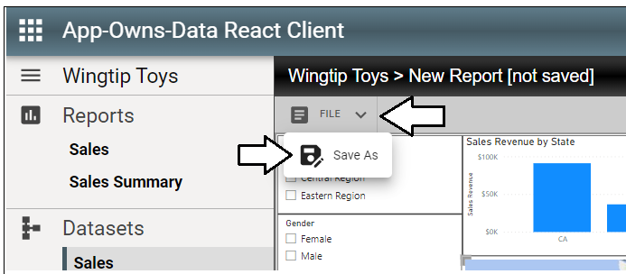

In the **Enter report name** dialog, enter a name such as **Sales by
Year and Quarter** and click the **Save** button.

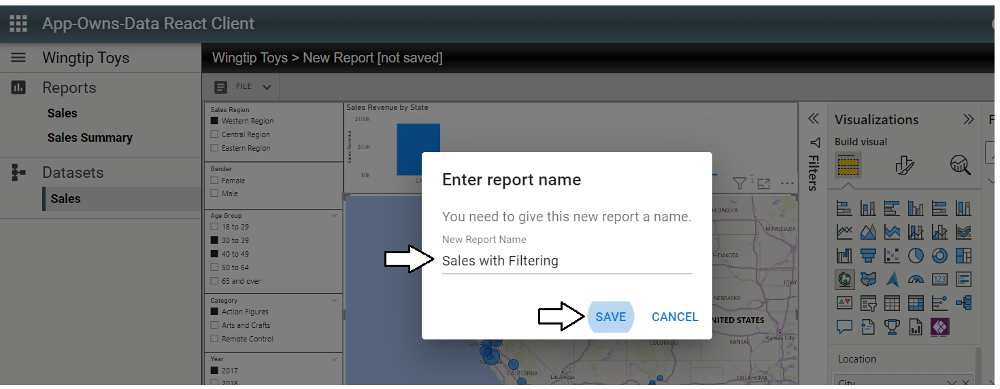

After saving the report, you should see in the left navigation and the
application breadcrumb are updated appropriately.

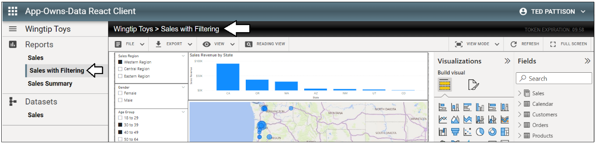

You have now seen how to configure user permissions for viewing, editing
and creating content.

## Use the Activity Log to monitor usage and report performance

At this point, you've used either **AppOwnsDataClient** and/or
**AppOwnsDataReportClient** to view, edit and create reports. While you
were testing **AppOwnsDataClient,** this application was executing API
calls to the **ActivityLog** endpoint of **AppOwnsDataWebApi** to log
user activity. The **ActivityLog** controller in **AppOwnsDataWebApi**
responds to these API calls by inserting a new record in the
**ActivityLog** table of **AppOwnsDataDB** to record that user activity.

You can run a simple SQL query against the of the raw data in the
**ActivityLog** table to get a sense of the type of data that is being
stored in an **ActivityLog** record.

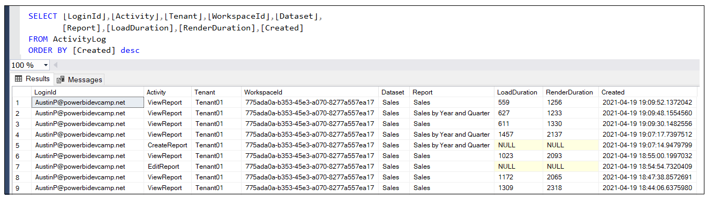

### Inspect usage and performance data using AppOwsDataUsageReporting.pbix

The **App-Owns-Data Starter Kit** solution provides a starter report
template named
[**AppOwsDataUsageReporting.pbix**](AppOwsDataUsageReporting.pbix)
designed to import the data from **AppOwnsDataDB** and provide analysis
on usage across users and report performance.

For example, the **Activity Log** page in this report displays the most
recent events in the **ActivityLog** tables. This page provides the
ability to view events of all types which have **Activity** column
values such as **ViewReport**, **EditReport**, **CreateReport** and
**CopyReport**. There's also a slicer providing the ability to filter
events for a specific user.

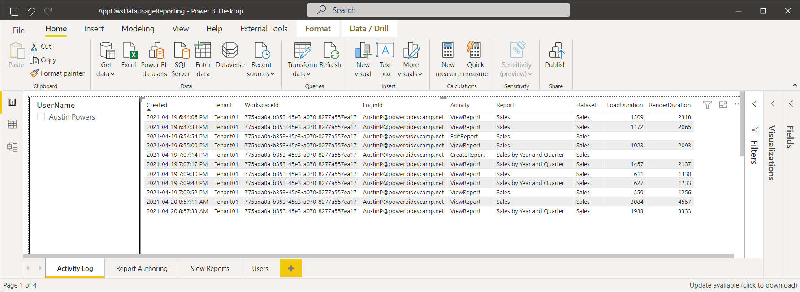

You will notice that each record with an **Activity** value of
**ViewReport** includes numeric values for the columns named
**LoadDuration** and **RenderDuration**. These numeric values represent
the number of milliseconds it took for the report to complete the
loading phase and the rendering phase.

The code to capture this performance-related data during the report
embedding process is included in the
[**app.ts**](https://github.com/PowerBiDevCamp/App-Owns-Data-Starter-Kit/blob/main/AppOwnsDataClient/App/app.ts)
file in **AppOwnsDataClient**. The screenshot of the TypeScript code
below shows how things work at a high level. First the code captures the
current time in a variable named **timerStart** before starting the
embedding process with a call to **powerbi.embed**. There are event
handlers for the report's **loaded** event and **rendered** event which
measure the duration of how long it took to complete the loading and
rendering of the report.

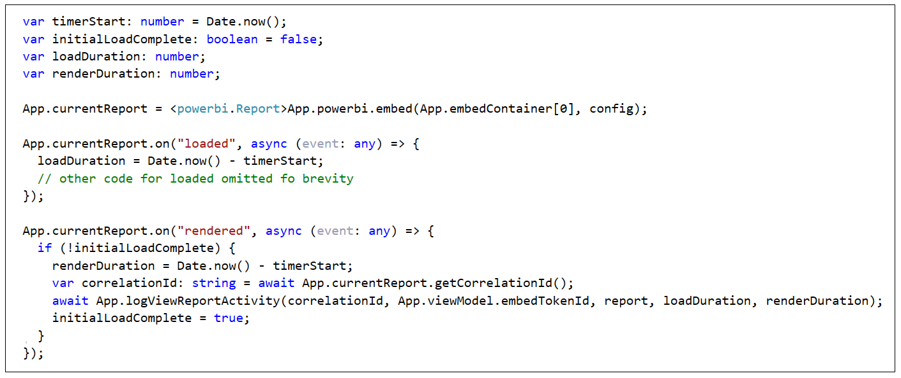

Note that the **loaded** event executes a single time when you embed a
report. However, the **rendered** event can execute more than once such
as in the case when the users navigates between pages or changes the
size of the hosting window. Therefore, the code to capture the rendering
duration and log the event has been designed to only execute once during
the initial loading of a report.

Given the performance-related data in the **ActivityLog** table, you can
add pages to
[**AppOwsDataUsageReporting.pbix**](file:///D:\Git\App-Owns-Data-Starter-Kit\AppOwsDataUsageReporting.pbix)
which allow you to monitor the performance of report loading and
rendering across all tenants in a multi-tenant environment. For example,
navigate to the **Slow Reports** page to see an example.

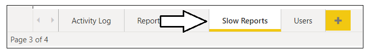

The **Slow Reports** page contains a table visual which displays the
average load time and average render time for any report that has been
embedded by **AppOwnsDataClient**. This table is sorted so that reports
with the longest render durations appear at the top and provide the
ability to see which reports need attention to make them more
performant.

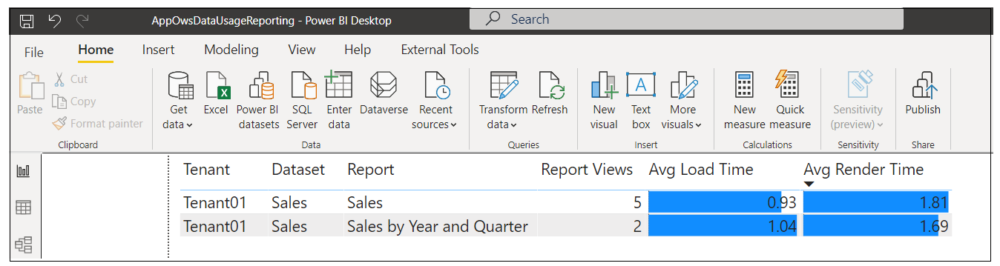

## Next Steps

This completes the technical walkthrough of the **App-Owns-Data Starter
Kit** solution. If you are just starting to develop with App-Owns-Data
embedding in a multi-tenant environment, hopefully you can leverage the
top-level application design and code from **AppOwnsDataAdmin**,
**AppOwnsDataWebApi**, **AppOwnsDataClient** and **AppOwnsDataShared**.

The **App-Owns-Data Starter Kit** solution has been designed to be a
generic starting point. You might find that your scenario requires you
to extend the **App-Owns-Data Starter Kit** solution in the following
ways

- Use a different [authentication
  provider](https://en.wikipedia.org/wiki/List_of_OAuth_providers) to
  login **AppOwnsDataClient** users and to make secure API calls.

- Create a more granular permissions scheme by adding more tables to
  **AppOwnsDataDB** to track permissions so that a single user can be
  associated with multiple tenants.

- Redesign the SPA for **AppOwnsDataClient** using a JavaScript
  framework such as React.js and Angular

- If you are developing with App-Owns-Data embedding in a multi-tenant
  environment where you expect more than 1000 customer tenants, this
  scenario requires extra attention because each service principal is
  limited in that it can only be a member of 1000 workspaces. If you
  need to create an environment with 5000 customer tenants (and 5000
  Power BI workspaces), you need to use at least 5 service principals.
  Check out the GitHub project named
  [TenantManagement](https://github.com/PowerBiDevCamp/TenantManagement/raw/main/TenantManagement/wwwroot/PBIX/DatasetTemplate.pbix)
  for guidance and a developer sample showing how to get started.
